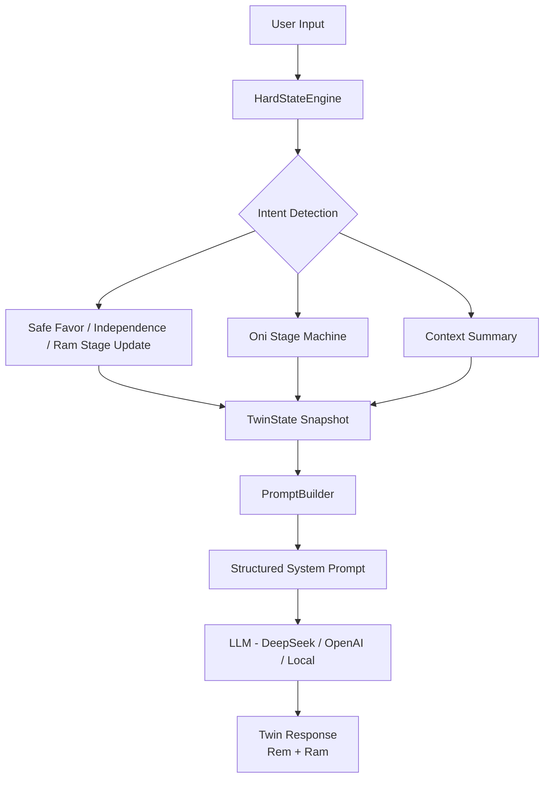
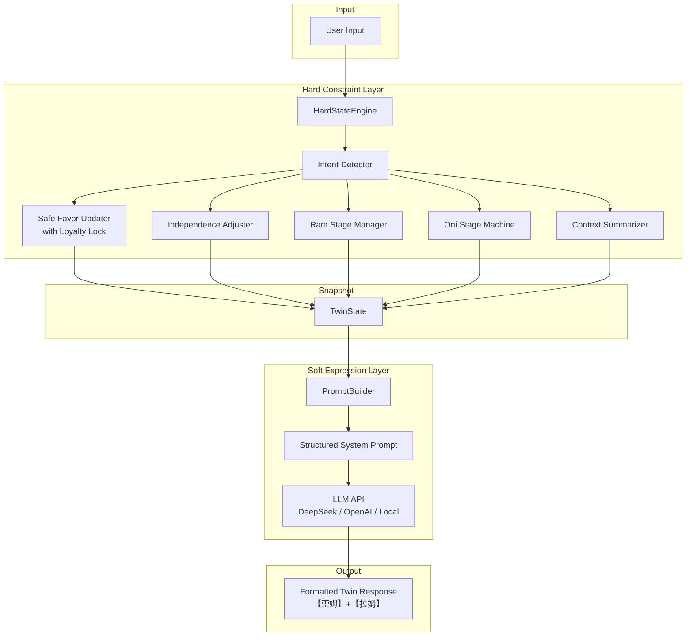
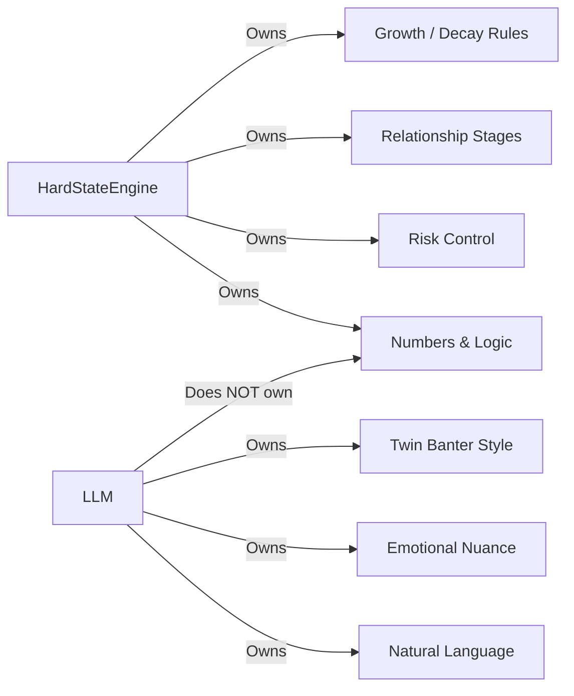
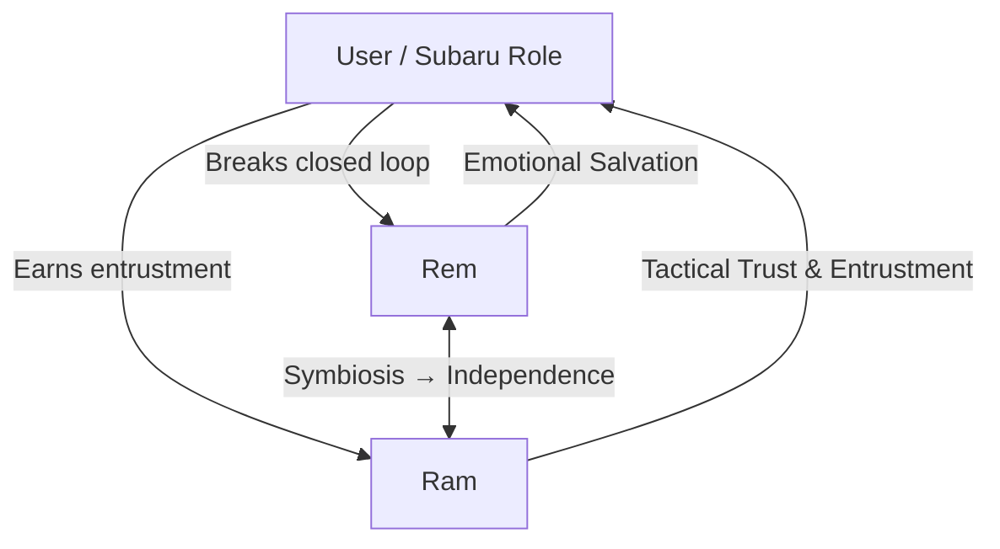

: Zero Twin System

> 拉姆 & 蕾姆双子女仆状态机 + 大模型灵魂表达系统
> 从规则引擎到「硬约束 × 软表达」的完整演进实践

一个以《Re:从零开始的异世界生活》双子女仆为核心的角色扮演系统。  
项目经历了从纯规则状态机 → 深度心理状态机 → 状态机与 LLM 桥接的完整迭代，最终目标是：

**既保留原著逻辑、数值增长与风控的硬性约束，又赋予大模型极具灵活性与灵魂的自然语言表达能力。**

---

## 项目愿景

在角色 AI 领域，常见两种极端：

- 纯规则系统：稳定但死板，缺乏灵魂
- 纯 LLM 系统：灵活但容易崩人设、忘记设定、数值混乱

本项目探索第三条路：**用状态机守护边界与成长逻辑，用大模型释放语言与情感的表现力**。

---

## 核心设计原则

1. **数值与逻辑必须由状态机掌控**（好感、独立度、评价阶段、鬼化等）
2. **大模型只负责「如何说」，不负责「变成什么」**
3. **关系是有结构的**（而非单纯好感加减）
   - 蕾姆：情感救赎 ↔ 人格独立
   - 拉姆：观察 → 认可 → 托付
4. **高好感后应具备「忠诚锁定」**，符合原著后期情感质感
5. **双子必须有功能分工**，而非简单轮流说话

---

## 架构概览

```
用户输入
 ↓
HardStateEngine（硬约束层）
 ├─ 意图识别
 ├─ 好感 / 独立度 / 拉姆阶段安全更新
 ├─ 鬼化阶段机
 ├─ 上下文摘要
 └─ 输出 TwinState 快照
 ↓
PromptBuilder（状态 → 自然语言指令）
 ↓
LLM（DeepSeek / OpenAI / 本地模型）
 ↓
符合当前状态的双子回复
```

---

## 版本演进路线（经验沉淀）

| 版本 | 核心突破 | 解决的关键问题 | 可复用经验 |
|------|------------------------------|------------------------------|--------------------------------|
| V4 | 修复基础崩溃点 + 第三人称 | 逻辑漏洞、替换粗暴 | 枚举比较、占位符、执行顺序 |
| V5 | 帝国篇失忆 + 鬼化细节 | 篇章差异缺失 | 状态分支对话库 |
| V6 | 动态画像 + 意图 + 轻推 | 只会安慰不会推动 | 会话状态与行为模式 |
| V7 | 好感忠诚锁定 | 好感莫名回落 | 高价值关系的「抗衰减」设计 |
| V8 | 拉姆评价阶段 + 主动性 | 拉姆沦为接话机器 | 配角也需要独立成长曲线 |
| V9 | 托付语义 + 人格独立度 + 破局者 | 关系缺乏结构与叙事感 | 从「好感」升级到「关系阶段」 |
| V9.1 | 状态机 × LLM 桥接 | 规则死板 vs LLM 失控 | 硬软分离的可落地范式 |
| V9.1.1 | GUI + EXE 落地 | 终端门槛高 | 状态持久化 + 一键运行 |

---

## 快速开始（LLM 版本）

### 安装依赖

```powershell
pip install openai python-dotenv
```

### 配置 API Key

在项目根目录创建 `.env` 文件：

```env
DEEPSEEK_API_KEY=sk-xxxxxxxxxxxxxxxxxxxxxxxxxxxxxxxx
```

### 终端启动

```powershell
python main.py
# 或指定模式
python main.py --mode llm
```

### GUI 启动

```powershell
python gui.py
```

### 终端常用指令

- `status`：查看当前全部硬状态
- `empire` / `mansion` / `late`：切换篇章
- `recover 0.6`：设置记忆恢复进度
- `quit`：退出

## 打包为可双击运行的 EXE

使用 PyInstaller：

```powershell
pyinstaller ReZeroTwin.spec --clean
```

打包完成后，`dist\ReZeroTwin.exe` 会生成，双击即可运行。窗口标题为 **"Re:Zero 双子系统"**，状态栏显示当前模式与状态。

> 注意：PyInstaller 输出末尾的 `Process exited with code 1` 不影响 EXE 正常生成，属于已知现象。

## 常见问题

### Q: 双击 EXE 后是本地模板模式，没有调用 Deepseek API
A: 删除旧的本地模式记忆文件：

```powershell
Remove-Item data\memory.json -ErrorAction SilentlyContinue
```

程序会重新生成 `mode: "llm"` 的默认记忆文件，再次启动即为 LLM 桥接模式。

### Q: 提示 `Insufficient Balance`
A: Deepseek 账号余额不足，需要充值。

### Q: 提示 `ModuleNotFoundError: No module named 'openai'`
A: 确保在当前 PowerShell 使用的 Python 环境中安装依赖：

```powershell
pip install openai python-dotenv
```

注意 Python 环境可能与系统 Python 不一致。

## 状态一览（V9+）

- 蕾姆好感 + 忠诚锁定
- 人格独立度（影响自卑与主体性）
- 拉姆独立好感 + 五阶段评价
- 鬼化三阶段 + 余韵
- 帝国篇记忆恢复进度
- 结构化上下文摘要
- 轻推与拖延检测
- 破局者彩蛋

## 设计启示（给未来项目的借鉴）

1. **先把「关系结构」想清楚，再写代码**
   好感只是表面，真正重要的是角色之间如何相互定义。

2. **高价值状态需要抗衰减设计**
   一旦角色付出了深度信任，就不该因为日常摩擦轻易回退。

3. **配角也值得独立状态机**
   拉姆的评价阶段与主动性，显著提升了整体体验的层次感。

4. **状态机负责「真」，LLM 负责「美」**
   这是目前较可持续的角色 AI 架构方向。

5. **彩蛋与叙事节点可以很低频，但必须有重量**
   破局者台词触发率极低，却能形成强烈的情感记忆点。

## 未来可能方向

- [ ] 流式输出支持
- [ ] 更细粒度的 post-generation 校验（防止 LLM 偶尔越界）
- [ ] 多轮上下文摘要的向量化记忆
- [ ] 拉姆与蕾姆的独立短期目标
- [ ] 可视化状态面板（WebUI）
- [ ] 支持更多原著后期篇章锚点

## 致谢与声明

本项目为个人学习与角色理解实践，所有角色与设定归属于《Re:从零开始的异世界生活》原作者与相关权利方。

仅用于技术探索与同人交流。

英文版：

## 1. English README.md

```markdown
# Re:Zero Twin System

> A stateful character system for Ram & Rem from *Re:Zero − Starting Life in Another World*  
> Evolving from pure rule-based engine to **Hard Constraints × Soft Expression** with LLM

This project implements a dual-maid role-playing system centered on Ram and Rem.  
It has gone through a complete iteration path: Rule Engine → Deep Psychological State Machine → State Machine + LLM Bridge.

**Core Goal**:  
Preserve the hard constraints of original lore, numerical progression, and risk control, while granting the LLM highly flexible and soulful natural language expression.

---

## Vision

In character AI, two extremes are common:

- Pure rule systems → Stable but rigid, lacking soul
- Pure LLM systems → Flexible but prone to persona collapse, forgotten settings, and numerical chaos

This project explores a third path:  
**Let the state machine guard boundaries and growth logic, while the LLM unleashes linguistic and emotional expressiveness.**

---

## Core Design Principles

1. **Numbers and logic must be controlled by the state machine** (favor, independence, evaluation stages, Oni form, etc.)
2. **The LLM is only responsible for “how to say it”, never for “what it becomes”**
3. **Relationships have structure** (not just favor point arithmetic)
   - Rem: Emotional salvation ↔ Personal independence
   - Ram: Observation → Recognition → Entrustment
4. **High favor should have “loyalty lock”**, matching the emotional quality of the later original work
5. **The twins must have functional division of labor**, not just taking turns speaking

---

## Architecture Overview



---

## Version Evolution (Key Insights)

| Version | Core Breakthrough                        | Key Problem Solved                  | Reusable Insight                          |
|---------|------------------------------------------|-------------------------------------|-------------------------------------------|
| V4      | Bug fixes + Strict third-person          | Logic crashes, crude replacement    | Enum comparison, placeholders, order      |
| V5      | Empire arc amnesia + Detailed Oni        | Missing arc differences             | State-branched dialogue libraries         |
| V6      | Dynamic profile + Intent + Gentle push   | Only comfort, no push               | Session state & behavior patterns         |
| V7      | Favor Loyalty Lock                       | Mysterious favor drops              | Anti-decay design for high-value bonds    |
| V8      | Ram Evaluation Stages + Initiative       | Ram reduced to reply machine        | Supporting characters need growth curves  |
| V9      | Entrustment + Independence + Breaker     | Relationships lack structure        | Upgrade from “favor” to “relationship stage” |
| V9.1    | State Machine × LLM Bridge               | Rules rigid vs LLM uncontrolled     | Hard-soft separation paradigm             |

---

## Quick Start (LLM Version)

```bash
pip install openai

export DEEPSEEK_API_KEY="your-key"
python rezero_bridge.py
```

Useful commands:
- `status` — View all hard states
- `empire` / `mansion` — Switch story arc
- `recover 0.6` — Set memory recovery progress
- `quit` — Exit

---

## Current State Features (V9+)

- Rem Favor + Loyalty Lock
- Identity Independence (affects inferiority & subjectivity)
- Ram Independent Favor + 5 Evaluation Stages
- Oni Transformation (3 stages + aftermath)
- Empire Arc Memory Recovery Progress
- Structured Context Summary
- Gentle Push + Procrastination Detection
- Breaker Easter Egg

---

## Design Insights for Future Projects

1. **Clarify relationship structure before writing code**  
   Favor is surface-level. What matters is how characters define each other.

2. **High-value states need anti-decay design**  
   Once deep trust is given, it should not easily regress from daily friction.

3. **Supporting characters deserve independent state machines**  
   Ram’s evaluation stages and initiative significantly elevated the overall experience.

4. **State machine owns “truth”, LLM owns “beauty”**  
   This is currently one of the more sustainable architectures for character AI.

5. **Easter eggs and narrative beats can be rare, but must carry weight**  
   The Breaker line has extremely low trigger rate, yet creates strong emotional memory.

---

## Possible Future Directions

- [ ] Streaming output support
- [ ] Finer post-generation validation
- [ ] Vectorized multi-turn context memory
- [ ] Independent short-term goals for Ram & Rem
- [ ] WebUI status panel
- [ ] More late-arc (Chapter 9/10) anchors

---

## Disclaimer

This is a personal learning and character understanding project.  
All characters and settings belong to the original author of *Re:Zero* and related rights holders.

For technical exploration and doujin exchange only.

---

**Maintainer**: [Your GitHub Username]  
**Last Updated**: 2026-07-30
```

---

## 2. Detailed Architecture Diagram (Mermaid)

You can put this in `docs/architecture.md` or directly in the README.

```markdown
# System Architecture

## High-Level Flow



## State Responsibility Separation



## Rem & Ram Relationship Structure


```

---

## 3. Contribution Guide / Development Standards

**File: `CONTRIBUTING.md`**

```markdown
# Contributing to Re:Zero Twin System

Thank you for your interest in improving this project.  
This document outlines the development standards and contribution process.

## Development Philosophy

- **State First**: Any new feature must first be expressible as a clear state or transition in the HardStateEngine.
- **LLM is a renderer, not a decision maker**: Never let the model directly modify favor, independence, stages, or other hard values.
- **Original Lore Priority**: When in conflict between “interesting” and “accurate to Re:Zero”, accuracy wins.
- **Small, Testable Changes**: Prefer focused pull requests over large rewrites.

## Code Standards

### Python
- Python 3.10+
- Use type hints for all public functions and class attributes
- Prefer `Enum` / `IntEnum` for states
- Keep functions focused; avoid methods longer than ~40 lines when possible
- Docstrings for all non-obvious classes and methods

### Naming
- Hard state related: `HardStateEngine`, `TwinState`, `safe_add_favor`
- Prompt related: `PromptBuilder`, `build_system_prompt`
- Character specific: `RemAI`, `RamAI` (if kept separate)

### State Update Rules
- All favor changes **must** go through `_safe_add_favor()` or equivalent guarded method
- Independence and Ram stage changes should be intentional and logged in reason strings when debugging
- Never decrease high-value states (BELOVED / ACKNOWLEDGED) without clear high-risk triggers

## Adding New Features

1. First design the **state impact** (what new field or transition is needed?)
2. Update `HardStateEngine` and `TwinState`
3. Extend `PromptBuilder` so the LLM receives clear natural language instructions about the new state
4. Add test cases or at least manual verification paths
5. Update CHANGELOG.md

## Prompt Engineering Guidelines

- Keep the system prompt structured and dense
- Translate numerical states into behavioral guidance (e.g. “Independence 0.8 → rarely uses substitute speech”)
- Prefer explicit instructions over hoping the model “understands”
- Temperature should generally stay between 0.6–0.75 for persona stability

## Testing Recommendations

Before submitting:
- [ ] Test favor lock behavior (try to drop favor after BELOVED)
- [ ] Test independence growth and its effect on inferiority lines
- [ ] Test Ram stage progression and entrustment lines
- [ ] Test Empire arc amnesia → recovery transition
- [ ] Test Oni stages and Ram’s reaction
- [ ] Verify LLM still respects output format under various states

## Pull Request Process

1. Fork the repository
2. Create a feature branch (`feature/ram-initiative-v2`)
3. Make your changes following the standards above
4. Update CHANGELOG.md under “Unreleased” or the appropriate version
5. Open a Pull Request with a clear description of:
   - What problem it solves
   - Which states are affected
   - How to test it

## Questions & Discussion

Feel free to open an Issue for:
- Design discussions
- Lore accuracy questions
- Architecture proposals

We value thoughtful discussion about character psychology and system design as much as code contributions.
```

---

## 4. Suggested Module Structure

Recommended directory layout for better maintainability:

```text
rezero-twin-system/
├── README.md
├── CHANGELOG.md
├── CONTRIBUTING.md
├── requirements.txt
├── .env.example
│
├── rezero/
│   ├── __init__.py
│   │
│   ├── core/
│   │   ├── __init__.py
│   │   ├── enums.py              # StoryArc, FavorLevel, RamStage, OniStage, Intent...
│   │   ├── state.py              # TwinState dataclass
│   │   └── hard_engine.py        # HardStateEngine (numerical & logic core)
│   │
│   ├── characters/
│   │   ├── __init__.py
│   │   ├── rem.py                # Rem-specific logic & independence
│   │   └── ram.py                # Ram stages, initiative, entrustment
│   │
│   ├── prompt/
│   │   ├── __init__.py
│   │   └── builder.py            # PromptBuilder
│   │
│   ├── llm/
│   │   ├── __init__.py
│   │   └── bridge.py             # ReZeroLLMBridge
│   │
│   └── utils/
│       ├── __init__.py
│       └── helpers.py
│
├── docs/
│   ├── architecture.md           # Mermaid diagrams + design notes
│   └── design_insights.md        # Longer reflections
│
├── examples/
│   └── basic_chat.py
│
└── tests/
    ├── test_favor_lock.py
    ├── test_independence.py
    └── test_ram_stages.py
```

### Module Responsibility Summary

| Module              | Responsibility                                      | Should NOT contain          |
|---------------------|-----------------------------------------------------|-----------------------------|
| `core/hard_engine.py` | All numerical updates, locks, stage transitions    | Any natural language        |
| `core/state.py`     | Pure data snapshot (`TwinState`)                    | Business logic              |
| `characters/rem.py` | Independence logic, Rem-specific reactions          | Ram logic                   |
| `characters/ram.py` | Evaluation stages, initiative, entrustment lines    | Rem favor logic             |
| `prompt/builder.py` | Convert `TwinState` → high-quality system prompt    | State mutation              |
| `llm/bridge.py`     | API calls, history management, orchestration        | Hard rules                  |


---

**维护者**：小东 & K 🦊  
**最后更新**：2026-07-31
