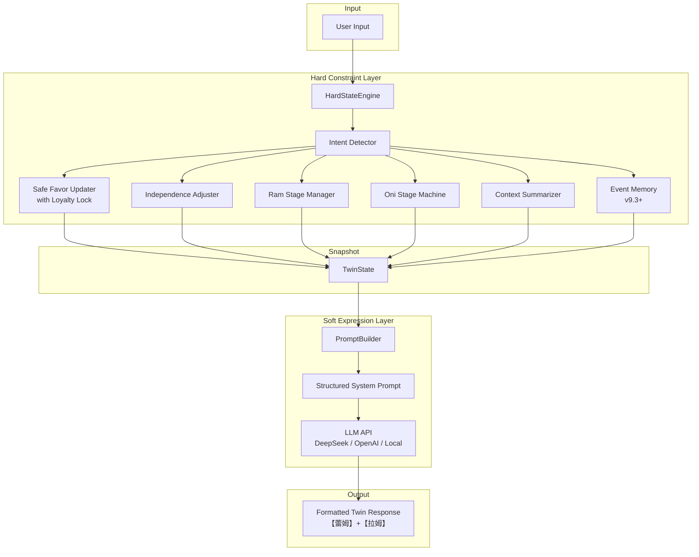
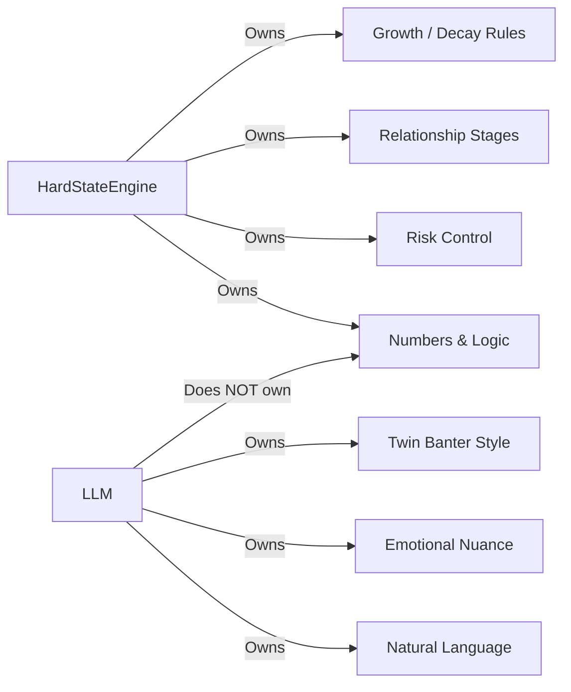
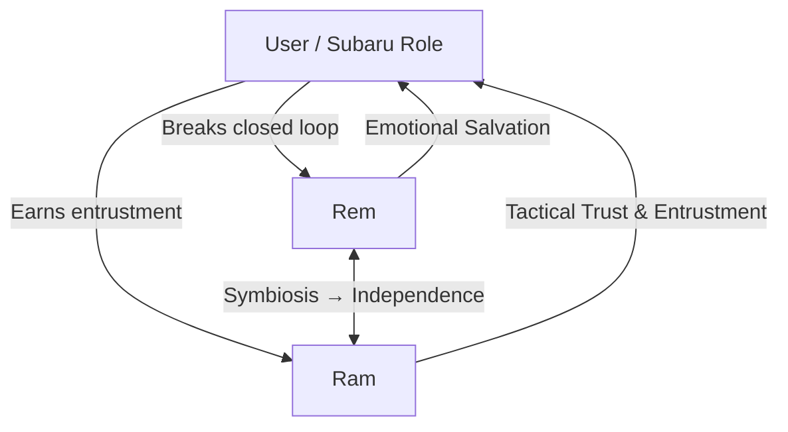

# System Architecture

## High-Level Flow

```mermaid
flowchart TB
    subgraph Input
        U[User Input]
    end

    subgraph Hard Constraint Layer
        HSE[HardStateEngine]
        ID[Intent Detector]
        SF[Safe Favor Updater<br/>with Loyalty Lock]
        IND[Independence Adjuster]
        RAM[Ram Stage Manager]
        ONI[Oni Stage Machine]
        CTX[Context Summarizer]
        EV[Event Memory<br/>v9.3+]
    end

    subgraph Snapshot
        TS[TwinState]
    end

    subgraph Soft Expression Layer
        PB[PromptBuilder]
        SP[Structured System Prompt]
        LLM[LLM API<br/>DeepSeek / OpenAI / Local]
    end

    subgraph Output
        RESP[Formatted Twin Response<br/>【蕾姆】+【拉姆】]
    end

    U --> HSE
    HSE --> ID
    ID --> SF & IND & RAM & ONI & CTX & EV
    SF & IND & RAM & ONI & CTX & EV --> TS
    TS --> PB
    PB --> SP
    SP --> LLM
    LLM --> RESP
```

## State Responsibility Separation

```mermaid
graph LR
    A[HardStateEngine] -->|Owns| B[Numbers & Logic]
    A -->|Owns| C[Risk Control]
    A -->|Owns| D[Relationship Stages]
    A -->|Owns| E[Growth / Decay Rules]

    F[LLM] -->|Owns| G[Natural Language]
    F -->|Owns| H[Emotional Nuance]
    F -->|Owns| I[Twin Banter Style]
    F -->|Does NOT own| B
```

## Rem & Ram Relationship Structure

```mermaid
graph TD
    SUB[User / Subaru Role] -->|Breaks closed loop| REM[Rem]
    SUB -->|Earns entrustment| RAM[Ram]

    REM -->|Emotional Salvation| SUB
    RAM -->|Tactical Trust & Entrustment| SUB

    REM <-->|Symbiosis → Independence| RAM
```
