# 组件树与状态归属（V16 · 2026-09-22）

> **SPEC**：SPEC-20260922-07 交付物｜**方法**：前端架构反向梳理法（角色 / 锚点 / 诊断标准 / 结构化输出）适配 PySide6 版
> **性质**：**只读审计**——本文件不含任何代码改动；所有结论均附 `文件:行号` 证据
> **基线**：`master` V16.3.3（`b65a1dd` 后）· 全量 `295 passed` · 冒烟 `31/31`
> **配套**：系统级架构与债务台账见 [`逆向架构Spec_V16_2026-09-22.md`](逆向架构Spec_V16_2026-09-22.md)（A1–A12）；本文新发现债务登记为 **A13–A18**

---

## 0. 怎么读（30 秒）

| 你想知道 | 看哪节 |
|---|---|
| 界面到底由哪些组件组成、谁装配谁 | §1 组件树（Mermaid + 分层清单） |
| 每个状态存在哪、谁读谁写、有没有双真源 | §2 状态归属矩阵（36 行） |
| 哪几处最危险、先修什么 | §3 痛点诊断（H1–H4 / M1–M6 / L1–L4） |
| 3831 行的 `gui.py` 怎么拆 | §4 微观梳理（现状逻辑树 → 目标目录结构 → 行数预算） |
| 施工顺序与验收判据 | §5 重构 Roadmap |
| 与旧台账的关系 | §6 交叉对照表 |

**三条本轮的硬结论**（先给结论再看细节）：
1. `gui.py` **不只是 UI 文件**——它同时住着「事件×天气判定」「双子回复解析器」「纯文本高亮」「资源解析」「日志」五类非 UI 逻辑（§1.4）。这是「巨型文件」的真正成因，不是样式多。
2. 界面里有**僵尸组件**：`rem_panel` / `ram_panel` 已 `hide()`，但仍被每次刷新推送状态（`gui.py:2095` / `2232` / `3079` / `3103`）——同一份状态同时喂 3 个消费者，其中 2 个不可见。
3. 项目里**有两个世界状态实现且都在生产路径上**：GUI 用 `shared.state.WorldState`（`gui.py:1689`），CLI 入口 `main.py` 与 `shared/vignette.py` 用 `shared.world_state`（`main.py:20` / `vignette.py:878`）。

---

## 1. 全局组件树（A 部分）

### 1.1 三个入口

| 入口 | 位置 | 说明 |
|---|---|---|
| GUI（EXE 真入口） | `gui.py:3815` `window = TwinChatApp()` → `ReZeroTwin.spec` 打包为 `dist/ReZeroTwin.exe` | **主路径** |
| CLI 备用入口 | `main.py:99 main() → run_llm(world)`（`main.py:23`） | 控制台交互；**走第二 WorldState**（见 H3） |
| 测试入口 | `tests/smoke_test.py`、`tests/test_ui_offscreen.py` 等构造 `TwinChatApp` | 非生产 |

### 1.2 组件树（Mermaid）

```mermaid
graph TD
    ENTRY_GUI["入口: gui.py:3815 __main__"] --> APP
    ENTRY_SPEC["打包: ReZeroTwin.spec → dist/ReZeroTwin.exe"] -. 打包 .-> ENTRY_GUI
    ENTRY_CLI["入口: main.py:99 run_llm 控制台"] -. 独立路径 .-> CLI_BOT
    CLI_BOT["逻辑: llm.bridge.ReZeroLLMBridge（CLI 版，无 GUI）"]

    APP["Page: TwinChatApp QMainWindow · gui.py:1643 · 2100 行 / 62 方法"]

    subgraph HEADER["顶栏 header · gui.py:1885-2020"]
        H_TITLE["展示: title_mark + title QLabel"]
        H_TABS["展示: 蕾姆/拉姆 tab QFrame ×2（无引用、无交互）"]
        H_MODE["展示: twin_mode QLabel（静态文案）"]
        H_AMBIENT["展示: _ambient_label · gui.py:1922"]
        H_SEARCH["容器: search_box + search_btn · gui.py:1929/1952"]
        H_ARC["展示: _arc_label · gui.py:1975"]
        H_ENTRY["容器: history_btn / book_btn · gui.py:1979/2000"]
    end
    APP --> HEADER

    subgraph NAV["左导航 side_nav · gui.py:2027-2084"]
        N_WEATHER["展示: _nav_weather · gui.py:2036"]
        N_BTNS["容器: nav_button ×7（闭包） · gui.py:2049-2069"]
        N_SYS["展示: _nav_sysstatus · gui.py:2072"]
        N_TWINS["展示: nav_twins（app_icon 放大 140px） · gui.py:2078"]
    end
    APP --> NAV

    subgraph CHAT["中央聊天区 · gui.py:2098-2219"]
        C_SCROLL["容器: scroll QScrollArea · gui.py:2101"]
        C_LIST["容器: chat_container + chat_layout · gui.py:2107-2114"]
        C_SAKURA["容器: sakura SakuraOverlay · gui.py:1168 / 2118"]
        C_INPUT["容器: input_frame · gui.py:2123"]
        C_QUOTE["容器: _quote_bar + _quote_label + _quote_close · gui.py:2131-2157"]
        C_QUICK["容器: quick_row 快捷按钮 ×5 · gui.py:2163-2189"]
        C_BOX["容器: input_box QTextEdit · gui.py:2196"]
        C_SEND["容器: send_btn · gui.py:2206"]
    end
    APP --> CHAT

    subgraph RIGHT["右栏 · gui.py:2088-2239"]
        R_REM["容器: rem_panel CharacterPanel（已 hide） · gui.py:2088/2095"]
        R_RAM["容器: ram_panel CharacterPanel（已 hide） · gui.py:2222/2232"]
        R_DASH["容器: dashboard CharacterDashboard · gui.py:2234"]
    end
    APP --> RIGHT

    subgraph BOTTOM["底部 · gui.py:2244-2288"]
        B_DOCK["容器: dock 图标坞 ×6（与左导航大量重复） · gui.py:2244-2266"]
        B_FOOTER["容器: footer + footer_label + _mode_label · gui.py:2269-2286"]
    end
    APP --> BOTTOM

    subgraph OVERLAY["浮层（懒创建）"]
        O_HIST["容器: HistoryOverlay · gui.py:1412（由 _open_history 创建 gui.py:3404）"]
        O_ITEM["展示: HistoryItemWidget · gui.py:1272"]
        O_BOOK["容器: MemoryBookOverlay · memory_book.py:133（gui.py:3425 创建）"]
    end
    APP --> OVERLAY
    O_HIST --> O_ITEM

    subgraph PRESENT["展示级组件（可复用）"]
        P_MSG["容器: ChatMessageWidget · gui.py:826"]
        P_AVATAR["展示: AvatarLabel · gui.py:565"]
        P_BUBBLE["展示: BubbleWidget · gui.py:621"]
        P_SYS["展示: SystemLabelWidget · gui.py:712"]
        P_CARD["展示: CharacterCard · status_dashboard.py:66"]
    end
    C_LIST --> P_MSG
    C_LIST --> P_SYS
    P_MSG --> P_AVATAR
    P_MSG --> P_BUBBLE
    R_DASH --> P_CARD

    subgraph WORKER["工作线程（业务逻辑）"]
        W_LLM["逻辑: LLMWorker QThread · gui.py:407（gui.py:2893 启动）"]
        W_VIG["逻辑: VignetteWorker · gui.py:2480（gui.py:2514 启动）"]
    end
    APP --> WORKER

    subgraph STORE["状态真理源"]
        S_MEM["MemoryStore → data/memory.json · shared/memory_store.py:40"]
        S_ENG["HardStateEngine（运行期真源） · shared/state.py:810"]
        S_WORLD["WorldState（GUI 版） · shared/state.py:350"]
        S_WORLD2["WorldState（第二实现） · shared/world_state.py（main.py:20 使用）"]
        S_DB["ConversationStore → data/conversations.db · shared/conversation_store.py:20"]
        S_LEDGER["LifeLedger → data/life.db（全局单例） · shared/life_ledger.py:144"]
    end
    APP -. 读/写 .-> S_MEM
    APP -. 读/写 .-> S_ENG
    APP -. 读/写 .-> S_WORLD
    ENTRY_CLI -. 读/写 .-> S_WORLD2
    APP -. 读 .-> S_DB
    APP -. 读 .-> S_LEDGER
    O_HIST -. 读 .-> S_DB
    O_BOOK -. 读 .-> S_DB
    O_BOOK -. 读 .-> S_LEDGER
```



### 1.3 分层清单（三类标注）

| 层级 | 组件 | 位置 | 行数 | 职责边界 |
|---|---|---|---|---|
| **页面级** | `TwinChatApp` | `gui.py:1643` | **2100**（62 方法） | 装配全部 UI + 命令路由 + 刷新链 + 落盘 + 线程管理 + 弹卡逻辑（职责已明显越界） |
| **容器级** | `CharacterPanel` | `gui.py:931` | 231 | 立绘 + 5 行状态（情绪/好感/好感条/阶段/标记）；**已 hide 但仍被刷新** |
| | `HistoryOverlay` | `gui.py:1412` | 225 | 历史检索浮层（自带搜索框/列表/展开） |
| | `MemoryBookOverlay` | `memory_book.py:133` | 217 | 回忆之书（相册/时间轴/纪念日/统计） |
| | `CharacterDashboard` | `status_dashboard.py:164` | — | 右栏双子双卡（Persistent State） |
| | `SakuraOverlay` | `gui.py:1168` | 98 | 樱花飘落（动画状态自持 `_timer/_petals`） |
| **展示级** | `ChatMessageWidget` | `gui.py:826` | 99 | 单条消息外壳（头像 + 气泡） |
| | `BubbleWidget` / `AvatarLabel` / `SystemLabelWidget` | `gui.py:621` / `565` / `712` | 89 / 54 / 112 | 气泡 / 头像 / 系统条 |
| | `HistoryItemWidget` | `gui.py:1272` | 138 | 历史列表单行（可展开） |
| | `CharacterCard` | `status_dashboard.py:66` | 96 | 单角色状态卡（`set_data` 单入口） |
| **逻辑（被 UI 文件托管）** | `LLMWorker` / `VignetteWorker` | `gui.py:407` / `2480` | 36 / 27 | QThread 工作对象（流式 / 引言生成） |

### 1.4 `gui.py` 里的「非 UI 逻辑」（关键发现）

`gui.py` 3831 行中，**约 500 行根本不是界面代码**，而是被托管在 UI 文件里的领域逻辑：

| 逻辑 | 位置 | 本应归属 | 关联债务 |
|---|---|---|---|
| `event_compatible(period, weather, event)` —— 事件×天气相容判定 | `gui.py:248` | `shared/scene_manager.py` 或统一判定器 | **B1 的 4 套判定之一就在 GUI 里** |
| `parse_twin_segments` / `match_speaker_tag` / `_streaming_segments` —— 双子回复解析 | `gui.py:355` / `276` / `298` | `shared/` 解析器（与 `llm/bridge.py` 那份合并） | **B3 双子解析器第 2 份** |
| `highlight_plain_text` —— 纯文本高亮 | `gui.py:170` | 与 `HistoryOverlay` 搜索共用 | M6 搜索双实现 |
| `_get_ambient_registry` —— 氛围文案注册表读取 | `gui.py:57` | `shared/`（注册表本体的邻居） | — |
| `_asset_path` / `_svg_pixmap` / `_theme_icon` / `_resolve_sprite` / `_backdrop_image_url` —— 资源解析与缓存 | `gui.py:445` / `454` / `511` / `555` / `480` | `ui/assets.py` | — |
| `_log` / `_log_path` —— 日志 | `gui.py:130` / `137` | `shared/config.py` 邻域 | A12 邻域 |

> 这说明 `gui.py` 的体量问题**不是样式堆出来的**，而是「UI + 领域逻辑 + 资源 + 日志」四类职责同文件。拆文件时按职责切，而不是按行数切。

---

## 2. 状态真理源与数据流矩阵（B 部分）

### 2.1 七类持久化真源 + 环境开关

| 真源 | 落地 | 写入者 | 读取者 |
|---|---|---|---|
| `HardStateEngine` | `data/memory.json` 的 `engine` 键（双写旧平铺键） | `gui.py:3349 _save_state`（唯一入口）· `llm/bridge.py` 回合提交 | 面板/状态栏/提示词构建 |
| `MemoryStore` | `data/memory.json` 本体 | `MemoryStore.save`（`memory_store.py:124`，原子写） | GUI 启动加载、CLI 启动加载 |
| `WorldState`（GUI 版） | `data/memory.json` 的 `world_state` 键 | `gui.py:3366` | `_refresh_ambient`、`_update_status_bar`、日更/来信/氛围判定 |
| `WorldState`（第二实现） | `world_state.json`（`shared/world_state.py`） | `main.py:113 save_world_state`；`shared/vignette.py:878` 读 | **CLI 路径**（与 GUI 真源并行，见 H3） |
| `ConversationStore` | `data/conversations.db` | `append`（GUI 与 CLI 都写） | `_load_history`、HistoryOverlay、MemoryBookOverlay |
| `LifeLedger` | `data/life.db`（append-only） | `record_day_facts` / 纪念/来信流程 | `_refresh_ambient`（只读计数）、MemoryBook |
| 缓存产物 | `data/vignette_cache.json`（`vignette.py:69`）· `data/backdrop_cache.png`（`gui.py:492`） | 引言生成 / 背景渲染 | 预热读取（可再生） |
| 环境开关（Module 作用域） | 7 个 `REZERO_*` | 进程启动时读取 | 跨模块（`REZERO_LIFE_DB` 17 处、`REZERO_DISABLE_VIGNETTE` 16 处…） |

### 2.2 状态归属矩阵（36 行）

| # | 状态 | 作用域 | 真理源（file:line） | 消费方 | 传递方式 | 冗余 / 下沉风险 |
|---|---|---|---|---|---|---|
| 1 | `arc` 篇章 | Global | `shared/state.py:841` → `memory.json:engine.arc` + 平铺 `arc` | `_arc_label`(gui.py:2391)、提示词构建(bridge) | `self.engine` 属性(gui.py:1871) 直读 | **双写真源**（平铺键+engine 键）已收口读取，写入仍双份 |
| 2 | `favor` | Global | `state.py:842` | `_update_panels`(3080)、`_update_status_bar`(3168)、dashboard(3119) | 同左 | 3 处消费者；RA 风险低 |
| 3 | `ram_favor` | Global | `state.py:846` | `_update_panels`(3104/3122) | 同左 | 同上 |
| 4 | `independence` | Global | `state.py:844` | 面板(3084) | 同左 | 同上 |
| 5 | `recovery` | Global | `state.py:845` | 面板(3085) | 同左 | 同上 |
| 6 | `locked` 忠诚锁定 | Global | `state.py:843` | 面板(3083)、dashboard(3114/3119) | 同左 | 同上 |
| 7 | `oni_stage` 鬼化阶段 | Global | `state.py:847` | 面板表情分级(3058-3062/3091) | 同左 | 同上 |
| 8 | `witch_scent` 残香 | Global | `state.py:849` | 面板表情分级(3056/3089) | 同左 | 同上 |
| 9 | `consecutive_negative` | Global | `state.py:851` | 面板表情(3066) | 同左 | 同上 |
| 10 | `consecutive_procrastinate` | Global | `state.py:852` | 引擎内部（UI 不读） | 同左 | 死状态候选（UI 无消费） |
| 11 | `turn_count` | Global | `state.py:858` | 提示词/账本 | 同左 | 同上 |
| 12 | `user_name` | Global | `state.py:976` + `memory_store.py:73` 默认键 | `_refresh_ambient`(3136) | 同左 | 两处默认值（engine 与 store）需保持同源 |
| 13 | `events` 事件池记账 | Global | `state.py:981` | 提示词构建 | 同左 | — |
| 14 | `mode` | Global | `memory.json:mode`(`memory_store.py:80`) + `self.mode`(gui.py:1673) | `_create_bot`(1836) | 直读 | **死状态**：`_switch_mode`(2395) 已不切换，仅打印提示 |
| 15 | `world.period / weather` | Global | `state.py:358/360` → `world_state` 键 | `_refresh_ambient`(3133/3139)、`_update_status_bar`(3168) | `self.world` 直读 | **两处各自拼串**（截断长度还不同：14 vs 16，见 M3） |
| 16 | `world.active_event` | Global | `state.py:361` | 同上(3131/3156) | 同左 | 同上 |
| 17 | `world.scene` | Global | `state.py:363` | 场景首访记账（bridge） | 同左 | — |
| 18 | `world.last_greeting_date` | Global | `state.py:369` | 日更判定(1711) | 同左 | — |
| 19 | `world.character_actions` | Global | `state.py:373` | dashboard「正在做」(3113/3116) | 同左 | UI 语义直接绑领域字段（可接受） |
| 20 | `world.ambient_state` | Global | `state.py:379` | `_show_ambient_line`(3626) | 同左 | — |
| 21 | `world.last_letter_ts/date` | Global | `state.py:371/372` | 来信判定(1799) | 同左 | — |
| 22 | `world.scene_cooldowns / milestone_cooldowns` | Global | `state.py:377/378` | 场景/里程碑去重 | 同左 | — |
| 23 | 对话流水 | Global | `conversations.db`(`conversation_store.py:20`) | `_load_history`(3004)、HistoryOverlay(1424)、MemoryBookOverlay(memory_book.py:142) | 各自独立读库 | **3 个消费者各写各的展示层**（无共享 view-model） |
| 24 | 人生账本 | Global | `life.db`(`life_ledger.py:144` 单例) | `_refresh_ambient` 计数(3142)、MemoryBook | **模块级单例** | 隐式全局耦合：任何模块 `get_default_ledger()` 即写 |
| 25 | `_streaming_bubbles/_buffer/_active` | Local | `gui.py:1674-1676` | `_on_stream_token`(2903) | 实例属性 | 与 `LLMWorker` 线程交叉，见 A10 |
| 26 | `_current_speaker` | Local | `gui.py:1677` | `_set_speaking_panels`(3228/2912) | 实例属性 | 说话态在 3 面板同步（含 2 个隐藏面板） |
| 27 | `_quote` 引用 | Local | `gui.py:1685` | `_quote_bar`(2131)/`_on_quote_request`(3258) | 实例属性 | 正常 |
| 28 | `_pending_user_widget` | Local | `gui.py:1684` | 取消→failed 标记(2860) | 实例属性 | 正常 |
| 29 | `_llm_thread / _llm_worker` | Local | `gui.py:1680/1681` | `_teardown_llm_thread`(2831) | 实例属性 | 线程生命周期与窗口关闭耦合（closeEvent 3732） |
| 30 | `_history_overlay / _memory_book_overlay` | Local | `gui.py:1682/3420` | 懒创建/关闭(3436) | 实例属性 | 正常（浮层自持状态） |
| 31 | `_breath_group` 呼吸动画 | Local | `gui.py:1678` | `_setup_breathing`(3177) | 实例属性 | 与 motion 门联动 |
| 32 | `_session_start_time` | Local | `gui.py:1683` | `_save_session_summary`(3565) | 实例属性 | 正常 |
| 33 | **`self.mem`（导入期快照）** | Local | `gui.py:1661` | 仅 2 处读(1849/1857) | 实例属性 | **陈旧副本**：与运行期真源 `engine` 不同步（A13） |
| 34 | `CharacterPanel` 内部态（`_speaking/_color/_emoji…`） | Widget | `gui.py:945-948` | 被 `update_state`(1091) 推入 | 方法推送 | **僵尸副本**：面板已 hide（A15） |
| 35 | `CharacterCard` 内部态（`_mood_label/_doing_label…`） | Widget | `status_dashboard.py:71-112` | `set_data`(status_dashboard.py:146) | 方法推送（单入口） | 正常（当前可见右栏） |
| 36 | 浮层局部态（`_keyword/_search_timer/_expanded/_petals`…） | Local | `gui.py:1426/1581/1295/1194`、`memory_book.py:142-295` | 各自浮层内 | 实例属性 | 与 #23 搜索双实现相关（M6） |

### 2.3 三条主干数据流

**① 启动恢复**：`MemoryStore.load`(gui.py:1661) → `WorldState.load_or_create`(1691) → `bot.engine.apply_dict`(1858，优先新 `engine` 键回落旧平铺键) → `_load_history`(1697) → `_show_resume_card`(3699) → 问候/来信/纪念卡分流(1716-1748)

**② 一轮对话**：`_send_message`(2756) → `_send_llm_stream`(2884) → `LLMWorker` 线程(gui.py:407/2893) → 流式 `_on_stream_token`(2903) → `_on_stream_finished`(2924) → `_parse_twin_reply`(2962) → `_finish_reply`(2989) → `_save_state`(2994) + `_update_panels`(2995) + `_update_status_bar`(2996)

**③ 状态→UI 刷新链**（现状是「按需散点调用」，不是统一订阅）：
`_update_panels` 8 处调用（1706/2360/2376/2379/2393/2877/2995）· `_update_status_bar` 6 处（1705/2392/2878/2996，内部再调 `_refresh_ambient` 3151）· `_save_state` 5 处（2374/2389/2994/3621/3734）
→ **风险**：任何新状态若忘记在某个路径补调用，界面就静默不同步（历史上 A2/A4 的成因同一族）。

---

## 3. 架构痛点诊断（C 部分，Severity 降序）

### 🔴 High

**H1 · `TwinChatApp` 巨型组件：2100 行 / 62 方法 / 单方法 413 行**（台账 **C1**；本次补行数预算与拆分方案）
- 证据：`gui.py:1643`（类）· `_setup_ui` `gui.py:1876-2289`（**413 行单方法**：布局 + 71 处内联 QSS + 信号接线 + 命令语义混在一处）
- 红线：单类 >500 行、单方法 >80 行（本项目版）
- 后果：任何界面改动都要在 4 千行文件里定位；`_setup_ui` 内部的闭包（`nav_button` `gui.py:2049`）与局部变量（tab/twin_mode）无法被测试直接触及
- 建议：按 §4.3 拆为 `ui/` 包；**级别 L3**（跨模块大重构，必须先在截图基线下分批）

**H2 · 僵尸组件双写（`rem_panel` / `ram_panel`）**（台账 **D3**；本次精确到行并施工化）
- 证据：`gui.py:2095` `self.rem_panel.hide()`、`gui.py:2232` `self.ram_panel.hide()`；但 `_update_panels` 仍每次推送 `update_state`（3079 / 3103），`_set_speaking_panels` 仍设说话描边（3228），`gui.py:2238` 还给隐藏面板设了立绘
- 判定：同一状态有 3 个消费者（2 个不可见）→ 状态冗余 + 无效刷新 + 未来改动陷阱（新人会以为面板仍生效）
- 建议：先二选一——(a) 删除面板与刷新（需真机确认无回归），(b) 保留但用显式开关跳过刷新；**级别 L1/L2**，观感类需真机确认

**H3 · 第二 WorldState 仍在生产路径（双实现双落盘）**（台账 **B6**；本次升级定性）
- 证据：`gui.py:1689` 用 `shared.state.WorldState`；`main.py:20` + `main.py:109/113` 用 `shared.world_state` 的 `load_world_state/save_world_state`；`shared/vignette.py:878` 亦从 `shared.world_state` 导入
- 后果：CLI 与 GUI 的世界状态**不是同一份**（字段、落盘位置、时序语义都可能不同）；`shared/vignette.py` 双入口解析也让 GUI 的引言路径可能读到另一份状态
- 建议：明确 `shared.state.WorldState` 为唯一真源 → CLI 改用它（或把 CLI 标记为退役并删 `main.py` 的 state 路径）；**级别 L2**
- 与旧台账关系：B4「`world_state.py` 兼容层」的**升级定性**（不是兼容层，是活的第二路径）

**H4 · `self.mem` 陈旧快照长期驻留**
- 证据：`gui.py:1661` `self.mem = self.store.load()`；读点仅 `gui.py:1849`（arc）与 `1857`（engine）；写入走 `_save_state`→`store.save`(3368) 与 `store.set`(1671/1839)
- 判定：内存里同时存在「加载时快照」与「运行期真源」，任何新代码读 `self.mem` 都会拿到陈旧值（与 A1/A2 同族）
- 建议：两处读点改走 `engine`，随后删除 `self.mem`；**级别 L1**（无观感变化，可由测试守卫）

### 🟡 Medium

**M1 · 导航语义错配与三重重复**（台账 **D1**；本次补图标坞重复证据）
- 证据：左导航 7 项（`gui.py:2063-2069`）中 **日程/任务/插件 → 都是 `/status`**、**关于 → `_open_history`**（语义错配：点「关于」弹出历史）**设置 → `/toggle`**（死功能，见 M4）；底部图标坞 6 项（`gui.py:2250-2257`）与左导航大量重复，其中 **主页/对话 都是 `input_box.setFocus()`**
- 判定：11 个入口实际只有 3 种行为 → 维护幻觉（改一处忘另一处）
- 建议：合并为**单一数据驱动导航表**（label/icon/action 三元组）+ 删除重复坞；**级别 L2**，观感类需真机确认

**M2 · 内联样式与 design token 双真源**
- 证据：`gui.py` **71 处 `setStyleSheet(`**（含 `_setup_ui` 内的巨型 QSS），而 `design_tokens.py` 已是唯一真源（`gui.py:155` / `status_dashboard.py:23` / `memory_book.py:28` / `motion.py:18` 都在消费）
- 后果：改主题要改多处；token 与硬编码色值并存
- 建议：QSS 收口到 `ui/theme.py`（只消费 token，禁止裸色值）；**级别 L2**，硬要求「视觉零变化 + 截图基线对比通过」

**M3 · 世界状态格式化两处（且截断长度不一致）**
- 证据：`_refresh_ambient` `gui.py:3133`（`🌙 {period} · {weather}`，事件截断 14 字 3132）vs `_update_status_bar` `gui.py:3168`（`{period} · {weather}` + 好感，事件截断 16 字 3158）
- 建议：抽 `format_world_line()` 单一入口；**级别 L1**

**M4 · `mode` 死状态与 `/toggle` 死命令**
- 证据：`_switch_mode` `gui.py:2395-2403` 只打印提示；命令 `/toggle /llm /local` 仍可达（2377）；`memory.json` 仍持久化 `mode`（`memory_store.py:80`），`_create_bot` 仍读并回写（1836/1839）
- 建议：删除命令分支与存档字段（或标注为「保留兼容」）；**级别 L1**（A3 死状态的一个实例）

**M5 · 拉姆表情映射硬编码在刷新函数里**（台账 **D3** 第三份语义表）
- 证据：`ram_emotion_map`（5 档中文→表情）写死在 `gui.py:3094-3101`，与 `FAVOR_LEVEL_CN`、`ram_stage.value` 构成第三套中文档位
- 建议：并入 `design_tokens.py` 或 `shared/` 的档位表；**级别 L1**（B 类「中文档位多份」的 GUI 侧实例）

**M6 · 搜索双实现**（台账 **B4**）
- 证据：主窗 `_do_search`(2538) + `highlight_hits`(2567) + `highlight_plain_text`(170) vs `HistoryOverlay` 自带 `_search_box`(1494)/`_keyword`(1576)/`_search_timer`(1581)
- 建议：抽 `SearchService`（关键词 → 命中 → 高亮 span），两处共用；**级别 L2**

### 🟢 Low

**L1 · 工作区遗留破坏性脚本 `test_mode.py`（未跟踪）**
- 证据：`test_mode.py:11-12` 会 `os.remove(data/memory.json)`；`test_mode.py:6-7` 用 `PROJECT_ROOT` 而非 `get_data_dir()`（违反 M2 后的路径纪律）；`git ls-files` 无此文件（`.gitignore` 保留忽略）
- 建议：直接删除本地文件（不进库）；若要留作工具，移到 `tools/` 并改走 `get_data_dir()` + 只读校验；**级别 L0**

**L2 · 死 UI：顶栏两个角色 tab 与「双子模式」标签**
- 证据：`gui.py:1898-1918` 全部为局部变量（无 `self.` 引用）、无交互接线；`twin_mode` 文案静态
- 建议：改为真实入口（点击聚焦对应角色）或明确降级为装饰并在代码注明；**级别 L0/L1**，观感类需真机确认

**L3 · 占位即视感：`nav_twins` 用 app_icon 放大当立绘**（台账 **D2**）
- 证据：`gui.py:2078-2083`（140px 图标当立绘位）、`gui.py:2238-2239`（又把同一张图塞给隐藏面板）
- 建议：接入真实立绘资源或明确占位标注；**级别 L1**，观感类**必须真机确认**（V16.0-mf 已声明「立绘层预留不放图」，此处属同一待办）

**L4 · `_log` 每次 `open+fsync` 调用于 UI 线程**
- 证据：`gui.py:137-148`（每次调用 `open(...,"a")` + `flush` + `fsync`），全文件 40+ 处调用（含 `_setup_ui` 路径）
- 风险：低概率交互抖动（尤其机械盘/杀软扫描时）；渲染/刷新热点里调用会放大
- 建议：改缓冲写或后台队列；**级别 L1**（性能类，需实测对比再定）

---

## 4. 递进式微观梳理：`gui.py`（3831 行）

### 4.1 现状内部逻辑树

```
gui.py (3831 行)
├── [模块级 57-406]  资源/日志/解析/判定工具（非 UI！）
│   ├── _get_ambient_registry(57) · _ui_motion_enabled(90) · _log_path(130) · _log(137)
│   ├── _rgba_to_qcolor(162) · highlight_plain_text(170)
│   ├── event_compatible(248)[领域判定] · match_speaker_tag(276)[解析]
│   ├── _streaming_segments(298)[解析] · parse_twin_segments(355)[解析]
│   └── LLMWorker(407)[线程]
├── [模块级 445-620] 资源解析与基础展示件
│   ├── _asset_path(445) · _svg_pixmap(454) · _backdrop_image_url(480)
│   ├── _theme_icon(511) · _resolve_sprite(555)
│   └── AvatarLabel(565) · BubbleWidget(621)
├── [620-1167] 展示件：SystemLabelWidget(712) · ChatMessageWidget(826) · CharacterPanel(931)
├── [1168-1411] 装饰与列表件：SakuraOverlay(1168) · HistoryItemWidget(1272)
├── [1412-1642] 浮层：HistoryOverlay(1412)
├── [1643-3743] TwinChatApp（2100 行 / 62 方法）
│   ├── 装配：__init__(1644) · _setup_ui(1876, 413 行) · _apply_theme(2290) · _create_bot(1833)
│   ├── 路由：_handle_command(2332) · _apply_arc(2386) · _switch_mode(2395)
│   ├── 会话：_send_message(2756) · _send_sync(2805) · _send_llm_stream(2884) · 流回调 2903/2924/2953
│   ├── 渲染：_append_parsed_message(2666) · _insert_streaming_bubble(2724) · _apply_turn_rhythm(2651)
│   ├── 刷新：_update_panels(3047) · _refresh_ambient(3127) · _update_status_bar(3149) · _set_speaking_panels(3228)
│   ├── 持久化：_save_state(3349) · _save_session_summary(3565)
│   ├── 浮层：_open_history(3398) · _open_memory_book(3420) · _close_history(3436)
│   ├── 弹卡：_show_daily_greeting(3585) · _show_resume_card(3699) · _maybe_show_memorial_card(1754) · _show_ambient_line(3626)
│   └── Qt 钩子：eventFilter(3375) · resizeEvent(3509) · closeEvent(3732)
└── [3744-3831] VignetteWorker(2480 已出) + __main__(3815)
```

**根因判断**：文件膨胀来自「**四类职责同文件**」（UI 装配 / 领域判定与解析 / 资源 / 日志），而非样式多少。因此拆分应**按职责切**，不按行数切。

### 4.2 状态归位建议

| 状态 | 现状 | 建议归位 |
|---|---|---|
| `_streaming_*` 三件套 | 主窗实例属性，被线程回调读写 | 收进 `StreamSession` 对象（`ui/controllers/stream.py`），主窗只持有引用；线程只回调该对象 |
| 刷新链（`_update_panels` / `_update_status_bar` / `_refresh_ambient`） | 8+6+1 处散点调用 | 抽 `PanelSync.refresh_all()` 单一入口 + 一个 `Qt 信号`（`state_changed`）订阅，消除「忘记调用」类 bug |
| 命令路由 | `_handle_command` if-elif 链 | 表驱动 `{"/status": handler, ...}`（`ui/controllers/commands.py`），与 `tests/test_command_router.py` 的断言对接 |
| `self.mem` | 导入期快照，2 处读 | 删除；读点改走 `engine`（H4） |
| 说话态 | 主窗属性 + 3 面板推送 | 收进 `PanelSync.set_speaker()`（顺带处理 H2 的僵尸面板） |
| 世界状态格式化 | 两处拼串（M3） | `ui/format.py: format_world_line()` 单一实现 |

### 4.3 重构后目录结构（建议）与行数预算

```
ui/
├── __init__.py
├── main_window.py          # TwinChatApp：装配 + 信号接线     目标 ≤400 行（现 2100）
├── theme.py                # 71 处内联 QSS → 集中（只消费 token）
├── format.py               # format_world_line / 中文档位映射（M3/M5）
├── assets.py               # _asset_path/_svg_pixmap/_theme_icon/_resolve_sprite/_backdrop_image_url
├── widgets/
│   ├── bubble.py           # BubbleWidget(621) + AvatarLabel(565)
│   ├── message.py          # ChatMessageWidget(826) + SystemLabelWidget(712)
│   ├── sakura.py           # SakuraOverlay(1168)
│   └── character_card.py   # CharacterPanel(931)（并入或退役，见 H2）
├── panels/
│   ├── header.py           # 顶栏（标题/tab/ambient/搜索/arc/入口按钮）
│   ├── side_nav.py         # 左导航（数据驱动 7→3 动作，见 M1）
│   ├── chat_view.py        # scroll + chat_container + 流式气泡
│   ├── input_bar.py        # 引用条 + 快捷行 + input_box + send_btn
│   ├── dashboard_panel.py  # 复用 status_dashboard.CharacterDashboard
│   └── status_bar.py       # footer + _mode_label
├── dialogs/
│   ├── history_overlay.py  # HistoryOverlay(1412)
│   ├── history_item.py     # HistoryItemWidget(1272)
│   └── memory_book.py      # 从 memory_book.py 迁入（保持行为）
├── workers/
│   └── llm_worker.py       # LLMWorker(407) + VignetteWorker(2480) + 线程生命周期
└── controllers/
    ├── chat.py             # _send_* / _on_* / _finish_reply / _save_state
    ├── commands.py         # _handle_command 表驱动
    ├── panel_sync.py       # _update_panels / _update_status_bar / _refresh_ambient 单一入口
    ├── overlays.py         # 浮层懒创建/关闭
    └── cards.py            # 日更问候 / 续聊卡 / 纪念卡 / 氛围行
```

**迁移顺序（每步可独立提交、可回滚）**：
1. `ui/assets.py` + `ui/format.py`（纯搬移，无行为变化）
2. `ui/widgets/*`（展示件，被测试直接覆盖）
3. `ui/dialogs/*`（浮层，独立度高）
4. `ui/workers/llm_worker.py`（线程边界清晰）
5. `ui/controllers/*`（刷新链与命令表驱动，**此时才动 H4/M3/M4**）
6. `ui/panels/*` + `main_window.py` 收尾（**最后一步**，同时删僵尸面板）

---

## 5. 重构 Roadmap（D 部分）

| 批次 | 内容（括号内 = 架构 Spec 台账 ID） | 级别 | 依赖 | 验收判据 | 真机确认 |
|---|---|---|---|---|---|
| **B0** | 删 `test_mode.py`（**A16**）· 顶栏死 UI 标注（**A17**） | L0 | — | `git status` 无该文件；文档登记 | 否 | ✅ **已执行 V16.4.0**（`281a0fa`；SPEC-20260922-12） |
| **B1** | 删 `self.mem` 陈旧读 2 处（**A13**） | L1 | — | 全量 295 passed；重启恢复一致 | 否 | ✅ **已执行 V16.4.0**（`5025a98`；复核：实为 **8 处**引用，全清零） |
| **B2** | 世界行统一格式化（**A15**）· 删 `/toggle` 死命令与 `mode` 字段（**A3** 实例）· 拉姆表情映射入 token（**D3** 实例） | L1 ×3 | — | 命令路由回归（`test_command_router.py`）+ 截图基线 | 否（文案不变） | ✅ **已执行 V16.4.0**（`dd17169` / `2f7f79a`；`mode` 字段已删，**`/toggle` 保留**——仍绑定「设置」入口，删除需设计决策） |
| **B3** | 僵尸面板处理：删面板或加显式跳过开关（**D3**） | L1/L2 | — | 截图基线一致；说话描边仍工作 | **是** |
| **B4** | 第二 WorldState 收口：CLI 统一到核心类或退役（**B6**） | L2 | 先确认无人依赖 `main.py` / `world_state.json` | CLI 冒烟可跑；`world_state.json` 不再新增 | 否（CLI） |
| **B5** | 导航合并为数据驱动表 + 删重复图标坞（**D1**） | L2 | B3 | 每个入口动作唯一；`test_command_router.py` 覆盖 | **是** |
| **B6** | 样式收口到 `ui/theme.py`（**A14**） | L2 | B5 | **视觉零变化**：截图基线逐张对比通过 | **是**（对比截图） |
| **B7** | 搜索合并为 `SearchService`（**B4**） | L2 | B6 | 两处搜索结果一致（同一关键词同命中） | 否 |
| **B8** | 拆 `ui/` 包（**C1**，§4.3 六步） | **L3** | B1–B7 完成 | 每步：全量测试 + 隔离校验 + 截图基线；`gui.py` 收敛为壳 | **是**（每步） |
| **独立** | 并发收口：commit 回主线程 / 加锁 / 不可变状态三选一（**A10**） | L2/L3 | 无强依赖 | 撕裂读探针 + 全量测试 | 否 |
| **可选** | `_log` 改缓冲写（**A18**，先做 A/B 计时） | L1 | — | 计时对比 + 全量测试 | 否 |
> 视觉回归保障已存在：`tests/test_screenshot_baseline.py`（含 `test_screenshot_capture_and_compare`），B3/B5/B6/B8 都应以它作为机械判据之一。

---

## 6. 与既有台账交叉对照（防重复登记）

> 规则：**既有台账已覆盖的债务不重复发 ID**，只在台账对应条目下补强——补强内容已写入 `逆向架构Spec_V16_2026-09-22.md` 的「A′. GUI 审计新登记」段（含复核更新表）。

### 6.1 本次新登记（台账 A′ 段，A13–A18）

| ID | 债务 | 级别 | 一句话 |
|---|---|---|---|
| **A13** | `self.mem` 陈旧快照 | P2 | 加载期快照与运行期真源并存，任何新代码读它即拿旧值 |
| **A14** | 内联样式 vs `design_tokens` 双真源 | P2 | `gui.py` 71 处 `setStyleSheet(` 与 token 并存 |
| **A15** | 世界状态行两处格式化 | P3 | 两处拼串，截断长度还不一致（14 vs 16 字） |
| **A16** | 工作区遗留破坏性脚本 `test_mode.py` | P3 | 会 `os.remove(data/memory.json)`，且用 `PROJECT_ROOT` |
| **A17** | 顶栏角色 tab / 「双子模式」死 UI | P3 | 局部变量、无引用、无交互 |
| **A18** | `_log` 每条 `fsync` | P3 | UI 线程 40+ 处调用；**待实测** |

### 6.2 既有条目：本次只补强，不发新 ID

| 既有 | 状态 | 本次补强 |
|---|---|---|
| A1 存档写读不对称 | ✅ V16.1 | 确认 `_save_state` 为唯一写入口 |
| A2 状态先于结果提交 | ✅ V16.2 | 刷新链仍是散点调用（§2.3 ③），提交语义已由事务收口 |
| A3 死状态 | ⏳ 部分 | **补齐实例**：`mode` + `/toggle`（M4） |
| A4 非原子写 | ✅ V16.1 | — |
| A7 测试写真实 data/ | ✅ V16.1 | — |
| A8 `arc_value` 未定义名 | ✅ V16.2 | — |
| A9 重复 `_handle_command` | ✅ V16.2.1 | 路由唯一（`gui.py:2332`）；本次未发现新的同名覆盖 |
| A10 跨线程并发写 | ⏳ | §4.2 的 `StreamSession` 归位可作候选解法之一 |
| A11 / A12 测试侧数据隔离 | ✅ V16.3.3 | — |
| B1 事件×天气 4 套判定 | ⏳ | 定位第 2 套在 GUI（`gui.py:248`），行号校正 |
| B3 双子解析器 2 份 | ⏳ | 定位在 GUI（`gui.py:276/298/355`） |
| B4 搜索双实现 | ⏳ | 行号校正 + 第三处共用点 `highlight_plain_text`（`gui.py:170`） |
| B6 `world_state.py` | ⏳ | **升级定性**：不是兼容层，是活的第二生产路径（H3） |
| C1 `gui.py` 巨型文件 | ⏳ | 给出拆分预算、目标目录与六步迁移（§4.3/§5） |
| C2 导入期求值开关 | ⏳ | `_VIGNETTE_DISABLED` / `_HISTORY_DISABLED`（`gui.py:75/78`）确认仍在 |
| C6 文档漂移 | ⏳ | 新增「行号漂移 +5~6」说明（本次实测） |
| D1 左导航 4 空壳 | ⏳ | 新增图标坞重复证据：**11 个入口 → 实际 3 种行为** |
| D2 立绘层空 | ⏳ | `nav_twins` 用 app_icon 放大占位（`gui.py:2078-2083`） |
| D3 状态呈现三处并存 | ⏳ | 僵尸面板双写精确到行（`2095/2232` hide vs `3079/3103` 仍推送） |

---
## 7. 本次未确认的项（诚实边界）

以下为**静态推断**结论，尚未经运行验证，**不进入 Roadmap 首梯队**：

1. **`rem_panel/ram_panel` 隐藏后仍刷新的运行时开销**：未实测帧率/CPU（推断为「无效工作但无害」）。
2. **`_log` fsync 的实际交互延迟**：未做 A/B 计时（L4 的「低概率抖动」是推断）。
3. **`shared/vignette.py:878` 是否在 GUI 路径真的会执行**：只确认了 import 存在，未追踪调用条件（若确实执行，H3 影响面比文中更大）。
4. **`main.py` 的 CLI 是否仍有人使用**：未在文档/脚本中找到调用方（`build.ps1` 打包的是 `gui.py`），推断为「低使用率备用入口」。
5. **顶栏两个角色 tab 的历史意图**：仅确认无引用（L2），未查 Git 历史确认是否为待接线功能。

> 复核方式：任何一条都可单独立 L1 SPEC（只读探针 + 一条断言）验证后再改，不必现在拍板。
