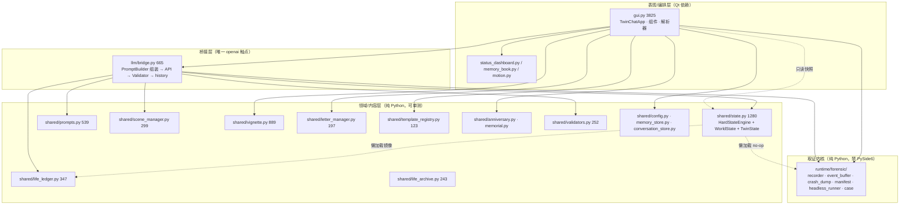

# Re:Zero Twin System — 逆向技术架构 Spec

**基线**：`master` @ `4fa6ccc`（V16.0.0-mf）+ 工作区干净
**梳理日期**：2026-09-22
**方法**：只读通读 git 历史（97 commits）/ `CHANGELOG.md`（2325 行）/ `docs/` 全部设计文档 + 核心模块源码逐段核对 + 一次性探针实测（跑完即删）
**验证状态**：`pytest tests/ -q` = **263 passed, 12.96s**（零 API）；另有 3 项状态层假设的 ad-hoc 探针结论见 §7
**适用范围**：本文是「当前实现的真实架构」，不是设计意图。设计意图见 `DESIGN_SYSTEM_V2.md` / `docs/design/*`；历史决策见 `CHANGELOG.md`。

> 前序两份报告（`技术研判报告_V10.4.0.md`、`技术研判报告_V14.8_2026-08-29.md`）是**当时快照**，其台账 D1–D6 / R1–R7 大部分已闭环或换了形态。本文以 V16 实测重出，**旧报告不得作为现状依据**。

## 整改进度（对应《架构 Spec 审批意见》）

| 批次 | 项 | 状态 |
|---|---|---|
| **V16.1**（2026-09-22） | M1 原子写 + 损坏不静默 · M2 引擎状态单源序列化 · A3 死状态清理 · A7 测试污染根因 | ✅ **已落地**（`276/276` 通过；`data/` 逐字节未变实测） |
| **V16.2**（2026-09-22） | M3 两阶段提交 `TurnTxn` · M4 三类失败路径测试 · M5 探针固化 · A8 场景首访记账未生效（施工中新发现） | ✅ **已落地**（`287/287` + 冒烟 `31/31`） |
| **V16.2.1**（2026-09-22） | A9 重复方法定义覆盖（`_handle_command` 两份 → 篇章指令报「未知指令」，真机确认阶段发现） · 命令路由单源化 | ✅ **已落地**（`294/294` + 冒烟 `31/31`；结构守卫入测） |
| V16.3（第 3 批） | M6 文档真源收敛 · M7 CI 门禁（含 `env -u PYTHONPATH` 坑） | 待施工 |

> 本文 §7 各行末尾标 ✅ 者为已修复；**未标 ✅ 的仍然成立**，按 §8 路线推进。

---

## 0. 一页速览

| 维度 | 现状 |
|---|---|
| 产品形态 | 桌面双子 AI（蕾姆/拉姆）× 单机 Python，「宅邸里真的有两个人在回应」 |
| 运行入口 | `gui.py`（PySide6 主入口 / EXE 入口）、`main.py`（CLI stdin 循环）、`tools/*`（离线工具） |
| 核心范式 | **硬状态机管「真」，LLM 管「美」**——数值/关系阶段/风控全部规则判定，LLM 无写权限 |
| 三层 | `shared/`（纯领域，零 Qt/零 openai）← `llm/bridge.py`（唯一 openai SDK 触点）← `gui.py`（表现/编排）；`runtime/forensic/` 独立无 PySide6 |
| 代码规模 | 生产 **18,777 行** / 测试 **6,288 行**（`gui.py` 单文件 3,825 行，占生产 20%） |
| 持久化 | 5 处落盘：`memory.json`（硬状态）/ `conversations.db`（对话流水+FTS5）/ `life.db`（人生账本）/ `album/`+`sprites/`（资产）/ `incidents/`+`.debug/`（取证现场） |
| 内容资产 | `registry.json` 91 条 / `letters.json` 58 条 / `scene_dialogue.json` 72 条目（宅邸 25·帝国 23·后期 24）/ `EVENT_POOL` 33 条（**硬编码在代码里**）/ `character_dialogue` 4 人 / `milestone_lines` 5 名场面 |
| 质量体系 | L0 263 项 pytest（零 API，13s）→ L1 headless 压测 → L2 真机审判循环（黄金剧本 51 探针 + 人设指纹门禁）；设计宪法 + 截图像素基线；Forensic 黑匣子（EXE 侧已接入） |
| 完成度 | 关系资产（V15「年轮」）与表现层（V16）已成体系；**缺口集中在「状态持久化正确性」「内容层统一」「gui.py 结构」三处** |

---

## 1. 分层与依赖方向



**实测依赖结论**：`shared/` 对 Qt 与 openai 零依赖（唯一例外是 `shared/state.py` 对 `runtime.forensic.recorder` 的懒加载、`shared/vignette.py` 对 `shared.world_state` 的懒加载）——这条纪律守得很好，是项目可测试性的根。

**已确立的 6 条契约（散落在代码注释与文档里，本文集中）**：

| 契约 | 内容 | 违约后果 |
|---|---|---|
| 硬软分离 | LLM 永不写状态；数值只经 `HardStateEngine.update()` 规则通道变化 | 数值幻觉/关系跳档 |
| View-Only 数据 | 引言/问候/续聊卡/轻氛围/纪念卡/偶发一句 → `save=False`，不进 `ConversationStore`、不进 LLM history | 展示内容污染长期记忆 |
| 输出格式 | 角色台词独占一行、`【蕾姆】:` / `【拉姆】:` 前缀、每轮 ≤1 处括号动作 | 解析器归类错误 |
| 状态安全 | 存档键（`.env`/`data/`/`dist/data/`）永不删除/覆盖，打包脚本内置备份 | 用户数据丢失 |
| 取证静默 | `record()`/`transition()` 未初始化即 no-op，任何失败不影响主流程 | 取证反噬产品 |
| 动效门 | offscreen/`REZERO_DISABLE_UI_MOTION` 下 `motion.enabled()=False`，零 effect 残留 | 离屏测试花屏 / 截图基线污染 |

---

## 2. 模块清单

| 模块 | 行数 | 职责 | 备注 |
|---|---|---|---|
| `gui.py` | 3825 | 全部 UI + 编排 + 领域解析（`parse_twin_segments`/`_streaming_segments`/`event_compatible`）+ 启动序列 + 线程管理 | God File，拆分已起步（token/动效/面板/回忆之书已出库） |
| `shared/state.py` | 1280 | `HardStateEngine`（数值/风控/意图/事件记忆）、`WorldState`（时间/天气/事件/冷却）、`TwinState` 快照、`StructuredProfile`、`EVENT_POOL` 33 条（**内嵌内容**） | 领域核心 |
| `shared/vignette.py` | 889 | 开场引言 L0-L3 多级生成 + `ContentLoader` 单例（content JSON 门面）+ `_derive_location` 地点推导 | 唯一"内容加载器"，其它模块各自直接 `open(json)` |
| `shared/prompts.py` | 539 | system prompt 组装（14 个 section 拼装）+ `SCENE_GUIDES` 12 场景引导 + `SCENE_CN` 场景中文名 | 场景 id 表（prompts 侧） |
| `shared/life_ledger.py` | 347 | 人生账本 life.db（append-only + dedup_key 幂等）+ 9 个语义化镜像 API + 历史回填 | V15「年轮」持久层 |
| `shared/conversation_store.py` | 322 | 对话流水 SQLite + FTS5 + 软状态（normal/recalled/deleted/failed）+ session 摘要表 | 三处 status 过滤口径不同（见 §3.3） |
| `shared/scene_manager.py` | 299 | 空间场景（关键词→场景→时段 slot→opening/interaction）、名场面联动、关键人物互动 | **类级可变状态**（轮转游标） |
| `shared/validators.py` | 252 | 后验校验：OOC 词表、蕾姆第一人称、数值泄露、格式、清理；A–E 级软警告 | 双路径调用（sync/stream 时机不同） |
| `shared/life_archive.py` | 243 | 关系资产导出/导入（manifest + sha256 + 路径安全 + 自动备份 + dry-run，**绝不半导**） | 可携带性契约 |
| `shared/letter_manager.py` | 197 | 主动来信（冷却/离线桶/发件人权重/安全插值/twins 拆分） | 纯模板零 API |
| `shared/anniversary.py` | 141 | 纪念日引擎（2026–2030 农历表 + 五类事实推导） | 元宵代码推导不存储 |
| `shared/memorial.py` | 127 | 纪念卡（L1 LLM → L2 注册表兜底）+ 相册落盘 | 文件即幂等 |
| `shared/template_registry.py` | 123 | 注册表选择器（arc→slot→bucket/period/weather/favor→确定性 hash） | 逐级放松 + arc 回落 |
| `shared/world_state.py` | 108 | **docx 兼容层**：第二个 `WorldState` 类 + 4 个同名函数 | 见 §7-B6 |
| `shared/config.py` | 95 | `.env` 五级查找 + `get_data_dir()`（frozen→EXE 同级 / 源码→项目根 / 只读兜底 %APPDATA%） | 全局路径单源 |
| `shared/memory_store.py` | 73 | memory.json 读写（**非原子写**，损坏静默回默认值） | 见 §7-A4 |
| `llm/bridge.py` | 665 | 唯一 openai 触点：`_build_messages` 组装 → `chat`/`chat_stream` → 校验 → history → 冷却 → 账本镜像；stale generation 拦截 | 懒加载 openai |
| `runtime/forensic/*` | ≈1,080（7 文件） | 事件环形缓冲（200/60s）、崩溃 dump、案件 manifest/claim、headless 复现通道、`transition()` 状态轨迹 | 纯 Python，CLI+EXE 双入口已接 |
| `design_tokens.py` / `motion.py` / `status_dashboard.py` / `memory_book.py` | 240/128/199/349 | 设计 token 唯一真源 / 动效运行时门 / Character Dashboard / 回忆之书浮层 | V15-M3 起的"新 UI 不再进 gui.py"纪律 |
| `tools/*` | 5 个 | 指纹、版本门禁、截图基线、账本导出/导入 CLI | 离线、零 API |

---

## 3. 数据模型

### 3.1 硬状态（`HardStateEngine` → `TwinState` 快照）

| 字段 | 语义 | 变化通道 | 落盘 | 重启恢复 |
|---|---|---|---|---|
| `arc` | 篇章（mansion/empire/late） | `set_arc()` | ✅ | ✅ |
| `favor` 0–100 | 蕾姆好感 | 高危 −12 / 冒犯 −3 / 表扬 +2 / 从零 +3 / 名字 +4 / 温情 +1 / 陪伴通道 +1（5涨3停）/ 重逢 +8 | ✅ | ✅ |
| `locked` | 忠诚锁定（favor≥95 自动） | `_safe_add_favor` 正增量 | ✅ | ❌ **丢失**（§7-A1） |
| `independence` 0–1 | 人格独立度 | 肯定 +0.06 / 自卑 −0.04 / 表扬 +0.01 / 重逢 +0.12 | ✅ | ✅ |
| `recovery` 0–1 | 记忆恢复 | `recover()`（跨 0.5 → 重逢） | ✅ | ✅ |
| `ram_favor` / `ram_stage` | 拉姆好感（五阶段阈值 25/46/66/85） | 提拉姆 +1 / 高危 −6 | ✅ | ✅ |
| `oni_stage` / `oni_aftermath` | 鬼化四阶（含余韵衰减） | update 内鬼化/危险分支 | ❌ | ❌ |
| `witch_scent` 0–5 | 魔女残香 | 高危 +2 | ❌ | ❌ |
| `is_reunion` / `breaker_triggered` | 叙事标记 | `recover()` / `mark_breaker_triggered()` | ❌ | ❌ |
| `turn_count` | 轮次（事件 seq） | 每次 update +1 | ❌ | ❌ |
| `consecutive_negative/procrastinate` | 连续负面/拖延（`wants_push` 依赖） | update 内计数 | ❌ | ❌ |
| `profile.context` / `interaction_patterns` | 短期上下文/互动模式 | 随 update 累积 | ❌ | ❌ |
| `_companion_gains/_cooldown` | 陪伴通道防刷（**设计上**重启重置） | 陪伴通道 | ❌（有意） | ❌（有意） |
| `events`（≤30，pinned 不淘汰） | 长期事件记忆（RAM，喂 prompt） | `_detect_events` | ✅ | ✅ |

**意图识别**：`_classify_intent` 纯关键词规则，11 类（FROM_ZERO / SELF_DOUBT / MENTION_RAM / BOUNDARY_TEST / DANGER / WORLD_LATE / PROCRASTINATE / VENT / QUICK / NORMAL），带否定语境豁免（`_is_negated`/`_contains_unnegated`，窗口 6 字）。**顺序敏感**：`替代品` 必须先于 `拉姆` 判定，否则自卑语境被 `MENTION_RAM` 抢走（代码有注释标记此契约）。

### 3.2 `WorldState` — 实际是「一个装了 6 类状态的神对象」

| 组 | 字段 |
|---|---|
| 时间/天气 | `current_time` `period`（7 档）`weather`（5 档加权 40/25/17/11/7）`weather_seed` `weather_last_change` `last_real_ts` |
| 离线 | `days_since_last` `last_interaction_ts` `last_period` |
| 活跃事件 | `active_event` `active_event_id` `event_generated_at`（TTL 24h） |
| 空间场景 | `scene` |
| 冷却（3 类） | `scene_cooldowns`（24h）`milestone_cooldowns`（24h）`ambient_state`（{last_event_id,last_ts,day,count}：2h + 日 3 条 + 事件 TTL 内 1 句） |
| 来信/问候 | `last_letter_ts` `last_letter_date` `last_greeting_date` |
| 表现 | `character_actions`（{rem,ram}） |

**确定性算法**：天气与事件选型统一 `md5(f"{date}_{period}_{weather}_{seed}")` 加权取模（种子随 ≥8h 离线演进）；**刻意不用内置 `hash()`**（带进程盐，V10.4 事故）。场景联动刷新最多 5 次换种子重试，耗尽后走「天气×时段兼容 ∩ 地点兼容」池兜底（V15-M1 推翻 V14.8 "flaky 已消除"结论后修复）。

### 3.3 存储层（三库五处）

| 存储 | 内容 | 关键性质 |
|---|---|---|
| `data/memory.json` | 硬状态 9 字段 + `world_state` 快照 + 遗留 `chat_history`（迁移后空数组） | **非原子写、无 schema 版本、解析失败静默回默认值** |
| `data/conversations.db` | `messages`（id/role/sender/content/created_at/status）+ `messages_fts`（FTS5 + 触发器）+ `session_summaries` | 三处 status 过滤口径**刻意不同**：GUI 展示 = normal+failed+recalled；搜索 = 仅 normal；LLM 恢复 = 仅 normal |
| `data/life.db` | `life_events`（ts/kind/title/detail JSON 快照/dedup_key UNIQUE） | append-only + 幂等；14 类 kind；**永不淘汰**，是"证明"而非"检索" |
| `data/album/*.md` · `data/sprites/*` | 纪念卡、用户立绘 | 文件即幂等/持久化 |
| `incidents/` · `.debug/CASE-*` | 崩溃现场 dump、案件工作目录 | gitignore，证据不入库 |

**回填链路**：`life_ledger.backfill_from()` 用 `conversations.db` 最早消息定义 `genesis`，用「引擎事件 `seq` = 第 N 条 user 消息时刻」映射历史时刻（`seq` 超出即回落 genesis）——**这条映射依赖 `turn_count` 单调性，而 `turn_count` 不落盘**（§7-A1 的连带风险）。

### 3.4 内容资产 schema

| 资产 | 结构 | 消费方 |
|---|---|---|
| `content/templates/registry.json`（91 items, schema 1.0） | `{id, arc, slot, text, offline_bucket?, recovery_range?, periods?, weathers?, favor_range?}`；slot ∈ vignette/proactive/return_flavor/status_flavor/twin_idle/ambient_remark | vignette L2、来信兜底、偶发一句 |
| `content/scene_dialogue.json`（schema 2.0） | `arc → scene → slot(MORNING/…) → {opening, interaction_1..3}`，每项 `{rem_view, ram_view}` | `SceneManager` |
| `content/letters.json`（58 条） | `{bucket, sender(rem/ram/twins), arcs?, conditions{min/max_favor,last_periods,current_periods}, text, suppress_vignette}` | `LetterManager` |
| `content/character_dialogue.json` | `{BEATRICE/ROSWAAL/EMILIA/PACK: {rem[], ram[]}}` | `SceneManager.get_character_lines` |
| `content/milestone_lines.json` | 5 名场面（oni_release / memory_fragment / zero_start / loyalty_lock / ram_entrust） | `SceneManager.get_milestone*` |
| `EVENT_POOL`（33 条） | **在 `shared/state.py:138-276` 硬编码**，含 weight/weathers/periods/rem_view/ram_view | 世界事件选型 + prompt 注入 |

---

## 4. 关键运行链路

### 4.1 启动序列（`TwinChatApp.__init__`，gui.py:1638-1744）

`MemoryStore.load()` → `ConversationStore()`（旧 JSON 历史一次性迁移）→ `WorldState.load_or_create()`（时段/离线天数/≥8h 天气推演/事件 TTL 判断）→ `_setup_ui()` → `_setup_breathing()` → `_apply_theme()` → `_load_history(30 条)` → `_show_resume_card()`（上次 session 摘要）→ `_create_bot()`（恢复引擎字段）→ `_update_status_bar/_update_panels` → **内容优先级链**：主动来信 > 日更问候（换日）> 空库完整引言 > 同日轻氛围 → 纪念卡。

`gui.main()`：`_install_crash_handler()`（写 crash.log）→ `init_forensic(data_dir/incidents)` → `QApplication` → `AppUserModelID` → `TwinChatApp` → `app.exec()`。

### 4.2 一轮流式对话（主干）

```
用户输入 → gui._send_message
  ├─ 命令拦截（/status /mansion /empire /late /recover /llm /toggle）→ 不发 LLM
  ├─ 引用校验（被引用消息可能已撤/删 → 取消引用并提示）
  └─ 线程：QThread + LLMWorker（信号 QueuedConnection）
        └─ bridge.chat_stream
             ├─ _build_messages()                       ← ⚠ 状态机已在此推进
             │    ├─ engine.update(text)   （数值/意图/事件/账本镜像/取证轨迹）
             │    ├─ 场景切换识别 + 场景首访记账 + 事件冲突联动刷新
             │    ├─ _detect_scene() 情感场景 + 冷却判定
             │    ├─ PromptBuilder.build() 14 段拼装
             │    ├─ 首轮氛围 / 今日纪念 / 引用（全部 View-Only 注入）
             ├─ API 流式请求（timeout=45s，可 env 覆盖）
             ├─ chunk 循环：取消检查 / generation stale 检查 / yield delta
             ├─ 全文 Validator 后验校验（失败 → 不写 history，回传回避文案）
             └─ 成功：写 history + 裁剪 8 条 + 场景冷却 + 名场面冷却 + 账本镜像
  ├─ gui._on_stream_token：_streaming_segments 分段 → 临时泡增删改（说话人点亮）
  └─ gui._on_stream_finished → parse_twin_segments → 正式泡（save=True）→ 删临时泡 → _finish_reply
                                     └─ _save_state() 全量写 memory.json + 面板/状态栏刷新
```

### 4.3 非对话注入（6 条，全部 `save=False`）

| 注入 | 触发 | 生成链 |
|---|---|---|
| 开场引言 | 空库启动 | L0 会话缓存 → L0 文件缓存 → L1 LLM（3 次重试+温度降档+校验）→ L2 动态模板 → L3 静态兜底；frozen/offscreen/无 key 走安全路径（不建线程不调 LLM） |
| 日更问候 | 换日 | 表驱动模板 + 天气白名单从句 + 事件兼容从句；**展示后立即持久化** |
| 轻氛围 + 偶发一句 | 同日重开 | 时段·天气·事件行；偶发一句 = registry slot=ambient_remark，seed=日\|事件id 确定性 |
| 主动来信 | 冷却/离线桶/权重采样全通过 | 纯模板插值（8h 间隔 + 日 1 次上限）；twins 按【蕾姆】/【拉姆】拆双泡 |
| 纪念卡 | 当日有节日/里程碑/周年 | L1 LLM（安全路径跳过）→ L2 registry 兜底 → 写 `album/` + 账本 |
| 续聊卡 | 有上次 session 摘要 | 规则摘要（不调 LLM） |

### 4.4 场景系统（两套并存）

- **空间场景**（`SceneManager`）：关键词 + 移动动词前缀（`去/到/回/进/来到/走去`，刻意排除"在"——O-3 修复）→ 场景键 → `_PERIOD_SLOTS` → 时段 slot → opening（切换一次）/interaction（每轮，轮转游标去重）/关键人物（4 人）。
- **情感场景**（`bridge._detect_scene`）：12 场景关键词 + 好感门槛 + 24h 冷却，命中后由 `prompts.SCENE_GUIDES` 注入引导文案，并标记高光变体气泡。
- 两者共享字面量 id，**没有类型或 schema 约束它们对齐**（§7-B5）。

### 4.5 取证内核（CLI + EXE 双入口已接）

`init_forensic(incidents_dir)` → 安装 excepthook（包装并透传 gui 自身的 crash.log）→ `EventRingBuffer`（200 事件 / 60s 双上限，`(startup_id, seq)` 跨进程分段，双时钟）→ 崩溃时 `IncidentWriter` 落 `dump.json` + 重命名退避（Defender）→ `manifest(claim)` 防双 Agent 认领 → `open_case/close_case` 案件状态机。状态轨迹：`_trace_transition` 只记低频跃迁（篇章/好感等级/拉姆阶段/鬼化/锁定），高频数值刻意不入缓冲。

---

## 5. 质量体系

| 层 | 内容 | 现状 |
|---|---|---|
| L0 | `pytest tests/` 33 文件 **263 项**、零 API、~13s | 全绿（本次实测） |
| L1 | `runtime/forensic/headless_runner` + 注入超时压测（M4 首案实测 18/24 = 75% 注入崩溃率、93 事件完整时间线可回放） | 可用 |
| L2 | 审判循环：黄金剧本 3 套 51 探针 + `persona_fingerprint` 8 指标 + `trial_gate` 三关卡（pytest / 剧本 diff / 漂移 >15% 拦截） | V15 首次全链路走通，真实拦截 4 项 A 级 |
| 视觉 | `design_tokens.py` 15 组 token + `DESIGN_SYSTEM_V2` 十项检查单 + `tools/screenshot_baseline.py` 像素 diff 基线 ×5 | 自对比 0.00% 零污染 |
| 数据 | `life_archive` 导出/导入（manifest+sha256+四连拒+往返等价） | 13 项测试覆盖 |

**缺席项**：无 CI、无 lint 配置、`pytest` 无 ini（`tests/` 靠 `conftest.py` 全局夹具与 sys.path 注入维系）、无覆盖率门槛。

---

## 6. 现在开始：技术债与「绕弯逻辑」

> 分级：**P0** = 会造成用户数据错误/丢失或状态失真且无告警；**P1** = 结构性重复真源，改动成本随时间上升；**P2** = 体验/工程卫生。
> 所有结论带 file:line；标 ⚑ 者本次用探针/实测复核过。

### A. 状态与持久化（最高优先）

**A1 [P0] ⚑ 存档写读不对称：`locked` 写了不读，另有 8 个字段根本不落盘**
- 证据：`gui.py:3349` 写 `"locked"`；`gui.py:1848-1853` 恢复段只读 favor/ram_favor/independence/recovery/events/user_name。探针实测：favor=100 且 `locked=True` 的引擎 → 按恢复逻辑重建后 `locked=False`（`favor_level` 仍为 BELOVED）。
- 影响：① system prompt 的「【忠诚锁定中，轻微负面不掉好感】」标记与面板 🔒 **在重启后消失**；② `_safe_add_favor` 的锁定豁免层只剩 `level>=BELOVED` 分支兜底（保护语义打折）；③ `oni_stage/witch_scent/is_reunion/breaker_triggered/turn_count/consecutive_*` **从未落盘**——鬼化态、魔女残香、连续负面（`wants_push` 轻推依赖它）每次重启归零；④ `turn_count` 归零破坏 `backfill_from()` 的 `seq → 第 N 条 user 消息` 映射。
- 修法（半天）：`HardStateEngine.to_dict()/from_dict()` 单源序列化，`_save_state`/`_create_bot` 都只调它；补一条「存档往返等价」单测（当前 **零测试**覆盖存档路径）。
- **状态：✅ 已修（V16.1）** — `to_dict/from_dict/apply_dict` 落地并成为唯一入口（`gui.py:_create_bot/_save_state`、`main.py`）；`tests/test_state_persistence.py` 覆盖全字段往返/重启存活/旧格式兼容。旧平铺键双写一版保回滚兼容。

**A2 [P0] ⚑ 状态先于结果提交：API 失败也推进状态机、也写账本**
- 证据：`llm/bridge.py:158` `self.engine.update(user_input)` 位于 `_build_messages()` 内，API 调用在其后（`chat` 的 try 在 418 行）；`state.py:887-930` `_detect_events` 在 update 内已把 `first_name/loyalty_lock/reunion/breaker` 等事实镜像进 **append-only 的 life.db**。
- 影响：一次网络抖动 → 好感/轮次/连续负面/G 化阶段全部照常变化（探针实测：一次表扬式输入后 `turn_count 0→1, favor 15→17`，即便随后 API 抛异常）；更重的是账本可能记下「从未真正发生」的事实，而账本**设计上永不删除**（只能靠 `dedup_key` 幂等，没有补偿通道）。
- 修法（1 天）：拆分「准备态 / 提交态」——`update()` 产出 pending 增量，reply 成功后 commit（含账本镜像）；失败走 discard 分支并 `record("TURN_DISCARDED")`。这条同时解决 §4.2 里"失败轮不写 history 但状态照涨"的语义不一致。
- **状态：✅ 已修（V16.2）** — `TurnTxn`（begin_turn/commit/discard）+ 轮内副作用 sink；bridge 的成功路径 commit、API 异常/校验失败/取消/流中断/stale/会话重置一律 discard；`tests/test_turn_commit.py` 11 条不变式断言。world 侧保留即时（小东决策：用户动作即事实）。

**A3 [P1] ⚑ 死状态：`engine.context_emotions` / `engine.open_topics` 只被裁剪与读取，从不写入**
- 证据：`state.py:782-783` 初始化 → `state.py:1111-1116` 仅 trim+读 → 全文无 append（写入发生在另一处 `profile.context.add_emotion/add_topic`）。探针实测：连续 3 轮负面输入后 `context_summary = '平稳 | 情绪: 负面 → 负面 → 负面'`——**首段「近期情绪倾向」恒为「平稳」**。
- 影响：prompt 里一行永远失真的状态描述（LLM 被喂了错误情绪信号）；且两个「情绪轨迹」容器同名不同源，接手者极易改错那一个。
- **状态：✅ 已修（V16.1）** — 死字段删除，新增 `_context_summary()` 收敛到 `profile.context`；回归用例 `test_context_summary_reflects_real_emotions`。

**A4 [P0] `MemoryStore` 非原子写 + 损坏静默重置**
- 证据：`shared/memory_store.py:53-55` 直接 `open(w)` + `json.dump`（无 tmp+rename、无备份、无 schema 版本）；`:47-48` `JSONDecodeError` 被吞掉，`load()` 回落到默认字典（favor 15 / arc mansion）。
- 影响：写盘瞬间掉电/崩溃 → 下一次启动**静默**把用户的关系进度重置为陌生人，且没有任何日志/告警；`_save_state` 每轮回复都全量重写该文件（`gui.py:3338-3357`），放大暴露面。
- 修法（半天）：tmp+`os.replace` 原子写 + `.bak` 轮转 + `schema_version` + 解析失败 `_log` 告警并走恢复（而非默认值）。
- **状态：✅ 已修（V16.1）** — 原子写 + `.bak` 轮转 + 三级降级（备份恢复 / `.corrupt-<ts>` 留证 + `SAVE_CORRUPTED` 告警）；4 条用例覆盖（原子写、备份恢复、双坏留证、半截 `.tmp`）。

**A5 [P2] 持久化时机不对称**
- 日更问候展示后**立即**持久化（`gui.py:3613-3615`），而主动来信的冷却写回只发生在内存（`letter_manager.py:190-192` 注释"调用方负责持久化 world"，`gui.py:1793-1823` 未做）。启动即来信后进程被杀 → 冷却丢失，同日可能重复来信（被"日 1 次"上限兜住，但 8h 间隔语义失效）。

**A6 [P2] scope 逃逸的类级可变状态**
- `SceneManager._interaction_rotor` / `_last_interaction`（`scene_manager.py:104-105`）——类 docstring 自称"无状态查询 + 静态资产（线程安全）"，实际持全局轮转游标：跨窗口/跨测试共享，且不可持久化（重启后同一格互动从头开始）。
- `ReZeroLLMBridge._anniv_cache`（`bridge.py:235`）类级字典，跨实例共享，仅按日期键失效。

**A7 [P1] ⚑ 测试写真实存档（V16.1 施工中发现并修复）**
- 根因两层：① `shared/memory_store.py` **import 期**绑定 `get_data_dir`，使 `tests/smoke_test.py::test_world_state_docx_compat` 的 `_config.get_data_dir = lambda: tmp` 补丁失效 → `save_world_state()` 写真实 `data/memory.json`（`world_state` 被测试世界覆盖）；② `tests/test_motion.py` / `test_status_dashboard.py` 构造主窗口未隔离存储，`win.close()` 的 `_save_state` 落真实盘。
- 影响：源码树存档的 `world_state`（场景/来信冷却/日更问候标记/活跃事件/离线天数）被长期覆盖（`favor/ram_favor/independence/events` 等数值字段完好）；**`dist/data/`（打包版实战存档）与 `data/life.db` 未被波及**。
- **状态：✅ 已修（V16.1）** — 调用时解析 `config.get_data_dir()` + 两处测试存储隔离 + `REZERO_GUI_LOG` 日志隔离 + 回归用例；新增验收口径「**跑完测试后 `data/` 逐字节不变**」（mtime+size 前后对比）。

**A8 [P1] ⚑ 场景首访记账从未生效（V16.2 施工中发现并修复）**
- 证据：`bridge.py:175` `mirror_scene_first(new_scene, arc_value)` —— `arc_value` 在 `_build_messages` 内**既无赋值也无外层定义**（AST 赋值/使用扫描确认），恒抛 `NameError`；外层 `except Exception: pass` 静默吞掉。旁证：`data/life.db` 只有 1 条 `genesis`，而真机已多次切换场景。
- 影响：人生账本「场景第一次到访」章节永久为空；且这类「try/except 包住整段业务」的写法让同类 bug 无法被任何测试或日志发现。
- **状态：✅ 已修（V16.2）** — 显式从 `state.arc` 取篇章值，并改为 `txn.defer_fact(...)` 随提交落账；回归用例 `test_scene_first_ledger_only_on_commit_and_arc_value_fixed`。

**A9 [P1] ⚑ 同类内重复方法定义（后者静默覆盖前者）——V16.2.1 发现并修复**
- 证据：`TwinChatApp._handle_command` 有两份定义（`gui.py` 上部完整路由 + 后部 V16-M_D 精简版），后定义生效 → `/mansion /empire /late` 全部落入「未知指令」；富状态面板成死代码。真机切换篇章时暴露。
- 为何长期无感：Python 类体后定义覆盖前定义**不报错、不告警**；GUI 测试只断言「窗口能建/面板有数」，从不驱动命令路由；两份方法都在同一个 3800 行文件里。
- **状态：✅ 已修（V16.2.1）** — 合并为唯一路由 + `_apply_arc()` 单路径 + `_send_message` 收敛；新增 `tests/test_command_router.py` 结构守卫（全项目 AST 扫重复方法名，property/setter 除外）——把「同类重复定义」这一整类 bug 变成 CI 可拦。**推广**：AST 结构守卫对付「不报错的覆盖/遮蔽」类债务，比行为测试更可靠。

### B. 重复真源 / 绕弯逻辑（结构性）

**B1 [P1] ⚑ 事件×天气/时段「兼容性」有 4 套互不相干的判定**
1. `state.py:381-386`：`EVENT_POOL` 的 `weathers/periods` 元数据过滤（选型时）；
2. `gui.py:242-267` + `gui.py:231/239`：`event_compatible()` 字符串启发式（`WEATHER_EVENT_CONFLICT` 关键词 + 时段词扫描）——用于问候/轻氛围/状态栏三处展示，**与 1 的规则集不同**；
3. `state.py:400-440`：`refresh_active_event` 内联「场景键→中文名」表 + `_derive_location` 地点校验 + 5 次换种子重试 + 兼容池兜底；
4. `bridge.py:178-191`：O-1 场景联动刷新，自己再查一次 `_derive_location` 与 `PromptBuilder.SCENE_CN`。
- 影响：同一对「事件 × 场景/天气」在选型期与展示期可能给出**不同结论**（选型说兼容、展示被跳过，或反之）；任何规则调整要改 4 处，V14.5→V14.8→V15-M1 的三次相关修复都散在这 4 处里。
- 修法：抽 `shared/scene_rules.py`（`derive_location` / `scene_cn` / `event_compatible(period, weather, event, scene)` 唯一实现），GUI 只调用。

**B2 [P1] 场景中文名三份独立表**
`prompts.py:132 SCENE_CN`（13 键）· `state.py:404-410` 内联副本（同 13 键，注释写明"与 prompts.SCENE_CN 一致；本地内联避免循环 import"）· `scene_manager.py:17 SCENE_KEYWORDS`（中文→键的**反向**表，另含同义词）。三份靠人工保持一致。

**B3 [P1] 双子回复解析器两份**（`gui.py:292 _streaming_segments` 与 `gui.py:349 parse_twin_segments`）
- 主体逐行相同，仅差「末行不完整标签跳过」与「空结果兜底」；且这是**领域协议解析**（LLM 输出契约）却住在 UI 文件里，测试只能 `from gui import parse_twin_segments` 整窗 import。
- 修法：`shared/segmenter.py` 单函数 + `allow_partial: bool`，GUI 与测试都改指向（注意同步 `tests/smoke_test.py:1059-1090` 的既有断言）。

**B4 [P2] 搜索逻辑两份**：`HistoryOverlay._do_search`（`gui.py:1580`）与 `TwinChatApp._do_search`（`gui.py:2509`），都包在 `ConversationStore.search()` 之上但各自实现高亮/空态/定位。

**B5 [P2] 「情感场景」概念双表靠字符串约定对齐**：`bridge.py:258 SCENE_KEYWORDS` + `:272 SCENE_FAVOR_MIN`（触发侧）↔ `prompts.py:58 SCENE_GUIDES`（文案侧），12 个 id 全靠字面量一致；没有断言保障（当前靠 `tests/test_scene_detection.py` 人工枚举）。

**B6 [P1] docx 兼容层仍在主路径上**
- `shared/world_state.py`（108 行）存在意义是"对齐外部 docx 设计文档的 API"：第二个 `WorldState` 类（继承核心类 + 字段别名属性）+ 4 个同名模块函数。
- 使用者：`main.py:20`（CLI 主入口）、`shared/vignette.py:878`（`prepare_session_opening`）、`tests/smoke_test.py:365/407`。GUI 主路径用 `shared.state.WorldState` —— **同一概念两个类型**，`isinstance` 判定会失效，且 `update_world_state_on_startup` 的参数（`weather_change_hours`）已被注释承认"实际不起作用"。
- 修法：把别名属性搬进核心类，CLI/vignette/测试改指核心类，删兼容模块（约半天，含回归）。

**B7 [P1] 内容层不统一：33 条 `EVENT_POOL` 硬编码在引擎里**
- `state.py:138-276` 的内容（含文案 + 角色视角）与 `content/*.json` + `registry.json`（91 条）形成双轨；V14.4 起的"内容资产化/注册表化"路线在这里断掉，改文案要动引擎源码、要重新打包，文案组无法独立贡献。
- 修法：`content/events.json` + 装载器（沿用 `ContentLoader`/`_load` 的 frozen 兼容模式），保留常量名做转口。

### C. 结构债（God File 沿线）

**C1 [P1] `gui.py` 3825 行仍是最大结构风险**：`TwinChatApp` 独占 1637-3825（≈2190 行、60+ 方法），`_setup_ui` 单方法 414 行（1871-2285，内部还有嵌套定义 `nav_button`）；领域规则（解析器、事件兼容、场景关键词、表情 11 档映射、系统摘要文案）都在这里。拆分已完成 4 刀（design_tokens / motion / status_dashboard / memory_book），**"新 UI 不进 gui.py" 纪律成立，但旧内容没有回迁计划**。
- 建议下一刀顺序：① 解析器 + 事件兼容出库（=B1+B3，解锁单测）；② `ChatStage`（滚动区 + 气泡 + 流式泡管理）独立；③ `TwinChatApp` 只留编排与信号接线。

**C2 [P2] 导入期求值的行为开关**：`gui.py:75-78` 的 `_HISTORY_DISABLED`/`_VIGNETTE_DISABLED` 在 import 时确定，导致行为取决于导入顺序——V14.8 曾因此让**所有测试窗口写真实库**，现在靠 `tests/conftest.py` 全局 `setdefault` 兜底（即"测试基建在替生产代码打补丁"）。建议改为 `_flag(name)` 函数式读取。

**C3 [P2] 宽泛异常吞噬是主流写法**：`except Exception: pass` / 静默 return 遍布（`state.py:26/41`、`bridge.py:190/214`、`life_ledger` 全部镜像、gui 十余处）。它买来了"绝不因附属功能崩溃"的稳定性（这是项目刻意选择），代价是**静默故障不可观测**——与 Forensic 轨道目标直接冲突。建议：统一 `_log` 或 `record()` 一行再吞，至少留下痕迹。

**C4 [P2] 无 CI / 无 lint / 无 pytest 配置**：263 项测试全靠人工跑；`tools/trial_gate.py` 已经是"脚本化门禁"的正确形态，接到 CI（或 pre-commit）只是加点 YAML。

**C5 [P2] 时间源无注入点**（15+ 处 `datetime.now()`/`date.today()`，跨 state/vignette/bridge/gui/letter/anniversary/ledger）。V15-M1 的 O-1 flaky 根因就是"种子固定了但时段/天气随真实时钟走"，当时的解法是"兼容池兜底 + 105 组合扫描"。给这些模块一个 `clock` 参数能把同类问题一次解决。

**C6 [P2] 文档漂移**：`docs/architecture.md` 仍是 V9 时代的三张图（无场景/来信/账本/取证/表现层）；`docs/工程惯例.md` 主线停在 V12.1；`tests/smoke_test.py` 的 docstring 里仍写着 local 模式。本文可作为新的架构基线，建议下版本把 `docs/architecture.md` 换成指向它的索引。

### D. 半成品与假入口（产品层）

**D1 [P1] 左导航 7 项中 4 项是空壳**：`gui.py:2058-2064` ——「日程」「任务」「插件」全部路由到 `/status`（把状态面板打进聊天流），「关于」实际打开**历史浮层**（`_open_history`）；只有「对话」「记忆」「设置(/toggle)」有真语义。导航是 V16-M_D 概念稿落地的产物，功能层没跟上 → 用户看到"点击没反应"或"点错东西"。
**D2 [P2] 中央四层结构（app_shell / backdrop / 立绘层 / 气泡层）只有前两层有内容**，立绘仍是 `assets/rem_sprite.jpg` 占位 + 用户拖入替换（V14.11）；Layer3 为 Live2D/立绘预留但空。
**D3 [P2] 状态呈现三处并存**：`CharacterPanel`（左/右，rem 已隐藏但对象与拖入能力保留）+ `CharacterDashboard`（右卡，V16 新）+ 状态栏一行 —— 同一份 `TwinState` 被投影三次，字段含义各写一遍（`_update_panels` 里 emoji 11 档/8 档映射是第三份"状态语义表"）。

---

## 7. 建议路线（按性价比排序）

| 批次 | 内容 | 成本 | 收益 |
|---|---|---|---|
| **第 1 批（1 天，止血）** | A4 原子写+备份+告警 → A1 引擎状态单源序列化 + 存档往返单测 → A3 删死状态 | 1 天 | 消除"重启丢进度/静默清零"这类 P0；把**零覆盖**的存档路径纳入测试 |
| **第 2 批（2 天，语义正确性）** | A2 状态提交两阶段（pending→commit / discard）+ 失败路径测试 | 2 天 | 失败轮不再污染数值与不可逆账本；同步解决"失败也不写 history"的语义不一致 |
| **第 3 批（2 天，结构归一）** | B1+B2+B3 出库为 `shared/scene_rules.py` + `shared/segmenter.py`（GUI 只做展示）→ B6 兼容层退场 | 2 天 | 一次消掉 4 套事件判定/3 份场景名表/2 份解析器；解锁领域单测；gui.py 自然瘦身 |
| **第 4 批（1 天，内容层）** | B7 `EVENT_POOL` → `content/events.json`；B4 搜索归一；C2 开关函数化 | 1 天 | 内容与引擎解耦（文案组可独立贡献）；去掉"导入顺序决定行为" |
| **第 5 批（按需）** | C1 `ChatStage` 拆分 → D1 导航项落地或明确禁用态 → C4 CI+ruff | 2-3 天 | 结构债不再复利；假入口消失 |

---

## 8. 附录：本次验证方式

```bash
# 基线（本次实测：263 passed, 12.96s）
env -u PYTHONPATH venv/Scripts/python.exe -m pytest tests/ -q

# 状态层 ad-hoc 探针（跑完已删，Temp/hermes-verify-arch-probe.py）
# A 存档不对称：favor=100 & locked=True → 复刻 _create_bot 恢复 → locked=False
# B 死状态：连续 3 轮负面 → context_summary 首段仍为「平稳」
# C 失败轮副作用：一次 update 即 turn_count 0→1、favor 15→17（API 前）
# D 内容规模：registry 91 / letters 58 / scene entries 72 / EVENT_POOL 33
```

**证据分级**：`file:line` 引用 = 静态核对（可信）；⚑ = 本次探针实测；其余数字取自 `CHANGELOG.md`（历史记录，未复核者已在文中标明来源）。
