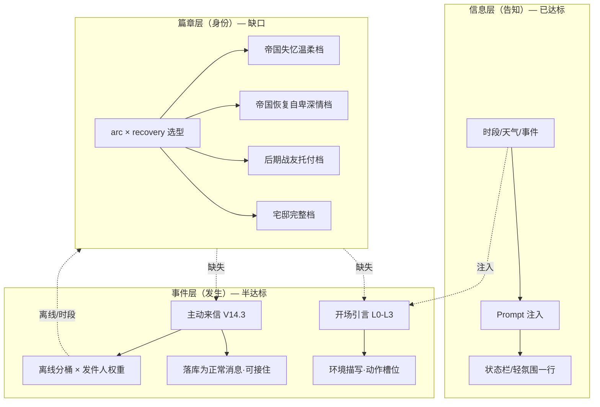
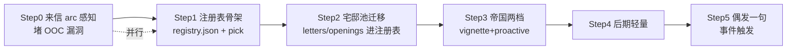

# 场景化内容密度与篇章模版池 · 全面研判报告

> 日期：2026-08-19 ｜ 依据：v14.3 主动来信落地后的源码实测（gui.py / shared/* / content/*）
> 结论一句话：**架构 7/10 的判断成立，内容密度 5/10 的判断成立且比想象更集中——差距不在「缺注册表」，而在「五个内容子系统全部宅邸化，且彼此桶口径不一」；V14.3 主动来信已落地，下一步最高性价比是把 arc/recovery 维度插进已有的来信与引言链路。**

---

## 0. 结论速览

| 维度 | 原评分 | 复核 | 依据 |
|------|--------|------|------|
| 架构意识（骨架） | 7/10 | ✅ 成立 | L0–L3 弹力网络、确定性天气/事件、冷却三红线、ContentLoader 单例 JSON 池，均为可扩展设计 |
| 内容密度 | 5/10 | ✅ 成立（略低） | 全部内容池（开场 6 + 动作 60 + 来信 40 + 问候 7 时段）**100% 宅邸语境**，帝国/后期篇章零内容文件 |
| 「主动生活感」 | — | ⚠️ **已比预期好** | V14.3 主动来信已落地（非「规划中」）：40 条模板、5 离线桶、发件人权重、冷却三红线，是全项目最接近「生活感」的机制 |
| 跨篇章统一池 | 应该做 | ✅ 必要 | 项目已有可参照范式（`ResponseLibrary` arc 分桶），但 vignette/letters/openings/greetings 四套文案池均未接入 arc |

**关键修正（相对任务书原判断）：**

1. **「主动来信（规划中）」→ 已落地**。`shared/letter_manager.py`（190 行）+ `content/letters.json`（40 条）+ `tests/test_letter_manager.py`（12 用例），全量 82/82 通过，`ReZeroTwin.spec` 已打包 content。优先级清单里第 1 项应从「做来信」改为「**来信 arc 感知化 + 文案扩池**」。
2. **引言与来信防叠 → 已实现**。`gui.py` 启动序列是硬互斥：`来信 > 日更问候 > 轻氛围 > 引言`（L1630–1654），不存在「有来信仍打长引言」的情况；`suppress_vignette` 字段实际未被消费（见 §3.5）。
3. **「半天/1/3/7 天」离线分级 → 来信侧已实现**（12h/24h/72h/168h 五桶），**但引言侧仍是粗桶**（`_pick_return_awareness` 只有 1/2/≤7/>7 四档，每档 1–2 句）——两处口径不一致，正是注册表统一要解决的第一个问题。
4. **帝国篇失忆「温柔→自卑深情」未产品化 → 属实且比判断更极端**：`PromptBuilder._build_special_states` 只有两档文字注入（recovery<0.4 / 0.4–0.85），而 **letters.json 的高好感来信（如「蕾姆好想您」「喜欢您」）在帝国篇会直接触发**——这是当前最危险的 OOC 漏洞（详见 §3.2）。

---

## 1. 现状盘点：七个子系统证据表

| # | 子系统 | 代码位置 | 已具备 | 缺口（实锤） |
|---|--------|----------|--------|--------------|
| 1 | 世界状态 | `shared/state.py` `WorldState` | 7 时段、5 天气（MD5 确定性）、8 条活跃事件（24h TTL）、真实离线天数 | 事件池 8 条全宅邸日常；无 arc 维度 |
| 2 | 世界→Prompt 注入 | `prompts.py` `PromptBuilder._build_world_section` / `_build_special_states` | 天气带昼夜描述注入；失忆两档文字提示（recovery<0.4 / 0.4–0.85） | 失忆注入**仅 LLM 模式生效**；本地模式无此档位（见 #5） |
| 3 | 开场引言 | `shared/vignette.py` | L0 会话/文件缓存 ｜ L1 LLM 重试+校验（90–140 字、违禁词）｜ L2 动态母板（PERIOD_DESC/WEATHER_DESC/动作库/短开场 30% 概率）｜ L3 静态兜底 | **纯宅邸心智**（PERIOD_DESC 全是「宅邸」）；L0 缓存 key **无 arc/recovery**；`_pick_short_opening` 是**硬编码 id 关键词匹配**（return/rain/night/sun_01/sun_02/fog），不是注册表 |
| 4 | 动作文案池 | `content/actions/{rem,ram,twin}.json` | rem 24 / ram 24 / twin 12，六分类（morning/tea/afternoon/evening/rain/return），JSON→内置常量→兜底三级回退 | 分类名全部 `mansion_*`；帝国/后期零条目 |
| 5 | 开场池 | `content/openings/mansion.json` | 6 条短开场（sun×2/rain/night/return/fog） | 仅 `opening_mansion` 一类；conditions 是伪代码字符串，实际按 id 关键词硬匹配 |
| 6 | **主动来信** | `shared/letter_manager.py` + `content/letters.json` | **V14.3 已落地**：40 条、5 桶（CROSS_PERIOD/HALF_DAY/DAYS_1_3/DAYS_3_7/LONG_ABSENCE）、favor 三档发件人权重、冷却三红线（首启排除/8h/每日1次）、白名单插值、twins 双泡拆分 | **无 arc/recovery 字段 → 帝国篇 OOC 风险**；模板全部「客人大人/女仆」宅邸称呼；`suppress_vignette` 未被消费 |
| 7 | 本地回复库 | `prompts.py` `ResponseLibrary` | **全项目唯一真 arc 分桶池**：`MANSION/EMPIRE/LATE × 意图(accompany/tired/sad/from_zero/oni_*/inferiority/aftermath/push) × 好感档` | amnesia 桶缺 push/aftermath 若干档；late 桶缺 oni_* 全家；ram 台词不随 arc 变（`RamAI` 无 arc 分支） |

**内容池规模实测**（2026-08-19 扫描）：

```
content/actions/rem.json   24 条  mansion_{morning,tea,afternoon,evening,rain,return} × 4
content/actions/ram.json   24 条  （同上）
content/actions/twin.json  12 条  （同上 × 2）
content/openings/mansion.json  6 条  opening_mansion
content/letters.json       40 条  CROSS_PERIOD:8 / HALF_DAY:8 / DAYS_1_3:8 / DAYS_3_7:7 / LONG_ABSENCE:9
data/vignette_cache.json    1 条  （LLM 主路径 + 缓存常清，缓存层实际命中率低）
```

**帝国/后期篇章内容文件数：0**。全仓库无 `empire_*`/`amnesia_*`/`late_*` 内容条目（`ResponseLibrary` 的 `_build_amnesia/_build_late` 是唯一非宅邸文案，且是 Python 代码内嵌）。

---

## 2. 感知模型：信息层 vs 事件层 vs 篇章层

用户的体感描述（「系统知道现在下雨」vs「因为下雨、又三天没见，蕾姆在门口说了句只有她会说的话」）可以精确映射到三层：



| 层 | 现状 | 用户可感知 | 缺什么 |
|----|------|-----------|--------|
| 信息层 | ✅ 完整 | 「系统知道现在下雨」 | — |
| 事件层 | 🟡 来信已落地、引言仍偏「描写」 | 「今天有来信」但**台词与篇章脱节** | 引言里角色「开口」的密度、事件触发偶发一句 |
| 篇章层 | 🔴 空白 | 帝国篇收到宅邸腔来信 → **出戏** | arc 分桶文案池 + recovery 两档选型 |

**一句话总结差距**：信息层把环境交给了 Prompt，事件层把「离线+时段」做成了来信，但**「环境×离线×篇章身份」三者从未在同一处合成**——这正是注册表要解决的乘积空间。

---

## 3. 五大关键发现（含对原分析的修正）

### 3.1 V14.3 主动来信已落地，且是全项目最成熟的内容机制

`letter_manager.py` 已具备任务书想要的几乎所有机制：

- **离线五桶**：`<12h 同时段静默 / <12h 跨时段 / 12–24h / 1–3d / 3–7d / ≥7d`（`calculate_offline_bucket`，L66–77）
- **发件人权重**：favor<30 拉姆 65% 主导 → ≥70 蕾姆 55% 主导，twins 对话体 10–25%（`select_sender`，L81–91）
- **冷却三红线**：首启排除（`last_interaction_ts<=0`）、最小间隔 8h、每自然日 1 封（`check_cooldown`，L53–61）
- **安全插值**：白名单 replace，模板笔误不抛 KeyError（`interpolate_text`，L95–101）
- **twins 双泡**：【蕾姆】/【拉姆】前缀拆分，UI 天然双气泡、落库成对（`split_twins_message`，L105–119）
- **落库为正常消息**：role=rem/ram，可右键删除、进搜索/回忆、进 LLM 上下文（用户首句回复能接住来信话题）——这是「生活感」最关键的一步，**已经做到了**

> 结论：任务书优先级第 1 项「V14.3 主动来信」**已完成**。真正的下一步不是「做来信」，而是「让来信说对的话」（§3.2）。

### 3.2 🔴 最高优先级漏洞：帝国篇来信 OOC

`letters.json` 40 条模板**没有任何 arc / recovery 字段**，`evaluate_and_dispatch` 的匹配维度只有 `bucket × sender × favor 区间 × 时段`（L146–162）。后果：

- 帝国篇（`recovery=0`，失忆蕾姆对用户礼貌疏离）在 favor≥70 时，会命中 `days_3_7_rem_high_01`：「{days_absent}天……蕾姆差点就要出去找您了。您知道吗，没有您的日子，蕾姆连呼吸都觉得困难。」
- 这与 `PromptBuilder._build_special_states` 注入的「失忆中的蕾姆对用户应保持温和但明显的距离感」**直接冲突**——LLM 被告知要疏离，模板来信却深情告白，同一启动序列两套人设。

修复方向（不重写引擎）：给模板加 `arcs: ["mansion_era"]` 与 `recovery_max` 字段，选择器过滤；帝国篇低 recovery 由 `arc=empire_era` + 专属模板兜底（§5 矩阵的帝国两档）。

### 3.3 引言缓存 key 缺 arc/recovery —— 跨篇章缓存污染

`build_cache_key`（vignette.py L584–589）只用 `period|weather|days_bucket|rem_level|ram_stage`。若同一存档在宅邸篇生成引言后切到帝国篇，**同状态桶会直接命中宅邸篇缓存**，引言永远是宅邸心智。注册表落地时缓存 key 必须加 `arc|recovery_bucket`。

### 3.4 离线桶口径不一致：来信五桶 vs 引言粗桶

| 系统 | 桶定义 | 每桶文案数 |
|------|--------|-----------|
| 来信 `calculate_offline_bucket` | <12h(跨时段)/12–24h/1–3d/3–7d/≥7d | 7–9 条/桶 |
| 引言 `_pick_return_awareness` | 1/2/≤7/>7 天 | **1–2 句/桶** |

引言侧的归来感是「锦上添花的一句话」，来信侧才是主力。建议：引言归来感合并进注册表 `slot=return_flavor`，复用来信桶口径（可降采样），避免两套桶定义长期漂移。

### 3.5 `suppress_vignette` 是死字段；「防叠」已由互斥链保证

`letter_manager.evaluate_and_dispatch` 返回 `suppress_vignette`（默认 True），但 `gui.py` 的启动序列是硬互斥（L1630–1654）：来信触发 → 跳过日更问候/轻氛围/引言。**该字段从未被任何调用方读取**。可保留为未来「空库来信」场景的开关（当前来信要求 `last_interaction_ts>0`，空库必不触发），或删除避免误导。

### 3.6 项目已有 arc 分桶范式：`ResponseLibrary` 就是注册表的雏形

`prompts.py L192–336`：`libs: Dict[StoryArc, Dict[key, Dict[FavorLevel, str]]]`，mansion/amnesia/late 三桶 × 意图 × 好感档，`get()` 带好感降级。**这证明团队早已有「同一套注册表、按 arc 分桶」的思维**——缺的是把它从「本地回复库」推广到 vignette/letters/openings/greetings 四套文案池，并把维度从 `(arc, intent, favor)` 扩展到 `(arc, slot, offline_bucket, period, weather, recovery)`。

---

## 4. TemplateRegistry 统一注册表设计（任务书级）

### 4.1 设计目标

1. **一套数据模型**承载 vignette / proactive / status_flavor / twin_idle / return_flavor / greeting 全部文案 slot，按 arc 分桶
2. **选择器单一入口**：`registry.pick(arc, slot, **ctx) -> Item`，确定性 hash 保证「同日同时段稳定」
3. **与现有四系统对接而非重写**：ContentLoader 加载、LetterManager 匹配逻辑、VignetteGenerator L2 取词、GUI 问候取词
4. **LLM 模式仍以状态注入为主**，模板池作 frozen / 失败 / 主动触达的底（沿用现有 L0–L3 定位）

### 4.2 数据模型（JSON schema）

```jsonc
// content/templates/registry.json —— 建议新文件，actions/openings/letters 逐步迁移或保留为 slot 子集
{
  "schema_version": 1,
  "arcs": ["mansion_era", "empire_era", "late_arc"],
  "buckets": {
    "offline": ["SAME_PERIOD", "CROSS_PERIOD", "HALF_DAY", "DAYS_1_3", "DAYS_3_7", "LONG_ABSENCE"],
    "recovery": ["AMNESIA", "RECOVERING", "RECOVERED"],
    "period": ["清晨", "上午", "午后", "下午", "傍晚", "夜晚", "深夜"]
  },
  "items": [
    {
      "id": "empire_proactive_days1_3_rem_low_01",
      "arc": "empire_era",                    // 必填：篇章分桶
      "slot": "proactive",                    // vignette|proactive|status_flavor|twin_idle|return_flavor|greeting
      "sender": "rem",                        // rem|ram|twins|none(旁白)
      "offline_bucket": "DAYS_1_3",           // 可选：离线桶（proactive/return_flavor 必填）
      "recovery_range": [0.0, 0.35],          // 可选：失忆低档用 [0,0.35]，恢复档 [0.35,0.85]
      "periods": ["all"],                     // 可选：时段过滤
      "weathers": ["小雨", "大雨"],           // 可选：加味，不是主句
      "favor_range": [0, 29],                 // 可选：好感区间（沿用 letter 现有约定）
      "weight": 10,                           // 权重（同键内采样）
      "text": "……",                          // 单条或 twins 双泡（【蕾姆】/【拉姆】前缀）
      "speaker_note": "失忆蕾姆：礼貌疏离，不确定称呼",
      "suppress_vignette": false              // 仅 proactive 语义
    }
  ]
}
```

### 4.3 选择器伪代码（确定性 + 加权）

```python
# shared/template_registry.py（新模块，纯逻辑零依赖，可单测——与 letter_manager 同风格）
def pick(registry, *, arc, slot, offline_bucket=None, recovery=None,
         period=None, weather=None, favor=None, seed="", rng=None):
    """同一把钥匙（arc, slot, bucket, period, weather, favor）在同一天内选型稳定。"""

    # 1. arc 分桶（必须）
    items = [it for it in registry["items"]
             if it["arc"] == arc and it["slot"] == slot]
    if not items:
        items = [it for it in registry["items"]
                 if it["arc"] == "mansion_era" and it["slot"] == slot]   # 兜底：宅邸通用
    if not items:
        return None

    # 2. 硬条件过滤（交集）
    def match(it):
        if offline_bucket and it.get("offline_bucket") \
                and it["offline_bucket"] != offline_bucket:
            return False
        if recovery is not None and it.get("recovery_range"):
            lo, hi = it["recovery_range"]
            if not (lo <= recovery <= hi):
                return False
        if period and it.get("periods") and "all" not in it["periods"] \
                and period not in it["periods"]:
            return False
        if weather and it.get("weathers") and weather not in it["weathers"]:
            return False
        if favor is not None and it.get("favor_range"):
            lo, hi = it["favor_range"]
            if not (lo <= favor <= hi):
                return False
        return True

    pool = [it for it in items if match(it)]
    if not pool:
        # 3. 逐级放松：weather → period → favor → offline_bucket（保留 arc+slot）
        for key in ("weathers", "periods", "favor_range", "offline_bucket"):
            pool = [it for it in items
                    if match_relaxed(it, drop=key, **locals_())]
            if pool:
                break

    # 4. 确定性 hash 选型（同 seed 同结果；seed 建议 = f"{date}_{period}"）
    if seed:
        pool.sort(key=lambda it: hashlib.md5(
            f"{seed}|{it['id']}".encode("utf-8")).hexdigest())
        return pool[0] if pool else None
    return random.choice(pool) if pool else None
```

**优先级（与任务书一致，但落地顺序修正）**：`arc`（必须）→ `slot` → `offline_bucket`/`recovery_range`（来信/归来引言必选其一）→ `period` → `weather`（加味）→ 确定性 hash（同日同时段稳定）。

### 4.4 与现有系统的对齐点

| 现有系统 | 接入方式 | 改动量 |
|----------|----------|--------|
| `ContentLoader`（vignette.py L161–236） | 扩展加载 `content/templates/registry.json`；`get(category, role)` 保持签名，内部按 arc 前缀（`empire_*`）路由 | 小：加一个文件路径 + 分类合并 |
| `LetterManager`（letter_manager.py） | `evaluate_and_dispatch` 增加 `arc`/`recovery` 参数透传 → 模板过滤加 `arcs`/`recovery_max` | 小：构造 ctx 时多取两字段 |
| `VignetteGenerator.generate` | 已透传 `recovery` 到 L2；L0 缓存 key 加 `arc|recovery_bucket`（修复 §3.3）；`_pick_short_opening` 的 id 硬匹配替换为注册表 `slot=vignette` 选型 | 中：缓存 key 一行 + 选型替换 |
| `_show_daily_greeting` / `_show_ambient_line`（gui.py） | 模板源从 `GREETING_TEMPLATES` 常量换为注册表 `slot=greeting/status_flavor`，按 arc 取词 | 小：取词函数替换 |
| `ResponseLibrary`（prompts.py） | 保持不动——它已是注册表范式，后续可作 `slot=response` 的迁移样板 | 无 |
| EXE 打包 | `ReZeroTwin.spec:14 ('content','content')` 已含整个 content 目录，**新文件自动进包** | 无 |

### 4.5 缓存键修正（一行）

```python
# vignette.py build_cache_key —— 增加 arc 与 recovery 桶
recovery_bucket = "a" if recovery >= 0.85 else ("r" if recovery >= 0.35 else "m")
raw = f"{arc.value}|{recovery_bucket}|{ws.period}|{ws.weather}|{days_bucket}|{rem_level}|{ram_stage}"
```

---

## 5. 篇章 × slot 文案矩阵（可执行版）

按任务书四篇章细化，slot 定义：`vignette`（开场引言）/ `proactive`（主动来信）/ `status_flavor`（日更问候·轻氛围）/ `twin_idle`（双子同屏动作）/ `return_flavor`（归来感）。

### 5.1 宅邸篇 `mansion_era`（先做完整，现有 60+40 条打底）

| slot | 重心 | 忌讳 | 建议补充 |
|------|------|------|----------|
| vignette | 女仆日常、红茶、庭院、罗兹瓦尔宅、姐妹吐槽 | 帝国地名、失忆腔 | 已有 6 条短开场 + 动作池 60 条；补「角色开口」类短开场（现状全是旁白） |
| proactive | 离线分级 + 跨时段 + 发件人权重 | 高好感也别每封都是告白（现状高好感三句里两句告白） | 加日常小事件类（茶凉了/野猫/采购清单），降低「每封信都煽情」 |
| status_flavor | 7 时段问候 + 5 天气白名单 | — | 已达标，保持 |
| twin_idle | 姐妹吐槽日常 | — | 12 条双泡，可扩到 18 条（加雨天/归来变体） |

### 5.2 帝国篇低 recovery `empire_era × [0, 0.35]`（优先级最高）

| slot | 重心 | 忌讳 | 范例句（供文案池扩写） |
|------|------|------|------------------------|
| vignette | 陌生国度、礼貌疏离、不确定称呼、蕾姆迷茫 | 「从零开始」神场景原句堆砌、过熟恋爱好感 | 「她看着您，像在看一个本该认识却想不起来的人。风从走廊尽头吹来，她轻轻侧开了目光。」 |
| proactive | 克制询问、保持距离的关心、不叫「客人大人」 | 高好感深情告白、女仆腔 | 「您……似乎很熟悉这里。虽然蕾姆想不起来为什么，但请至少，别再露出那种寂寞的表情。」 |
| return_flavor | 归来=「这个人似乎很重要」的模糊熟悉感 | 直接叫名字 | 「她站在门边停了几秒，像在确认什么，最终只是轻声说：您回来了。」 |
| status_flavor | 帝国语境时段问候（战场/旅店/篝火） | 宅邸/红茶意象 | — |

### 5.3 帝国篇恢复期 `empire_era × [0.35, 0.85]`（任务书「失忆温柔→自卑深情」过渡档）

| slot | 重心 | 忌讳 | 范例句 |
|------|------|------|--------|
| vignette | 记忆碎片式措辞、对巴鲁斯/姐姐的迟疑与靠近 | 一夜之间完全宅邸蕾姆 | 「她记起了红茶的味道，却想不起是谁教她沏的。她看着您，欲言又止。」 |
| proactive | 记忆回潮的自卑、试探性靠近、称呼逐渐变软 | 直接跳到 BELOVED 语感 | 「最近总梦见这座宅邸。梦里有您，也有姐姐……蕾姆分不清那是记忆，还是愿望。」 |
| twin_idle | 拉姆对妹妹恢复的复杂态度（欣慰+警戒） | 拉姆抢先深情 | — |

### 5.4 后期篇 `late_arc`（轻量即可）

| slot | 重心 | 忌讳 | 范例句 |
|------|------|------|--------|
| vignette | 战友感、托付、更克制的拉姆 | 早期「可疑的客人」口吻 | 「风停了。拉姆把剑还鞘，难得没有挖苦。有些并肩的路，走着走着就成了习惯。」 |
| proactive | 蕾姆深情但不 OOC（有战斗语境参照） | 每封都甜腻 | 「今天没有战斗，蕾姆反而不知道该怎么消磨时间了。……您要是不忙，陪蕾姆坐一会儿吧。」 |

---

## 6. 落地路线图（Step 0–5，每步可独立验收）



| Step | 内容 | 产出 | 验收标准 |
|------|------|------|----------|
| **0** | 来信 arc 感知（止血） | `letters.json` 全部条目加 `arcs:["mansion_era"]`；`evaluate_and_dispatch` 加 arc/recovery 过滤；帝国篇低 recovery 命中走「克制桶」或**静默跳过来信** | 帝国篇 favor=90 启动：不再出现深情告白来信；新增 ≥3 条 `arc:empire_era` 克制来信 |
| **1** | 注册表骨架 | `shared/template_registry.py`（pick + 校验）+ `content/templates/registry.json`（schema_version + 首批 30 条：宅邸 vignette 变体 + return_flavor 细桶） | 单测：确定性 hash 同日稳定；逐级放松路径全覆盖；无匹配返回 None 不抛 |
| **2** | 宅邸池迁移 | vignette `_pick_short_opening` 硬匹配 → registry `slot=vignette`；`_pick_return_awareness` → `slot=return_flavor`（复用来信五桶口径）；L0 缓存 key 加 arc/recovery（修 §3.3） | 回归 82/82；vignette 选型与旧硬匹配在同样本下分布不劣化 |
| **3** | 帝国两档 | `content/templates/registry.json` 增 `empire_era` × `recovery_range` 两档 vignette/proactive 各 8–12 条 | 手工冒烟：帝国篇低 recovery 启动，引言/来信均为疏离语感；恢复期出现「记忆碎片」语感 |
| **4** | 后期轻量 | `late_arc` vignette/proactive 各 5–8 条 | 同上，战友托付语感 |
| **5** | 偶发一句 | 事件触发 `slot=ambient_remark`（注册表 + 冷却 2h/日 3 条上限），**不进好感刷分** | 事件 TTL 内最多 1 句；无好感副作用（现有 82 测试全绿） |

**刻意不做**（与任务书一致）：为场景化重写状态机；为每句闲聊调 LLM 生成环境散文；事件偶发一句进好感/事件记忆通道；为每篇章复制一套 `VignetteGenerator`。

---

## 7. 附录：现状支撑数据

- **测试**：`tests/` 7 个文件（smoke/favor_growth/message_status/quote_reply/letter_manager/ui_offscreen/llm_failures），v14.3 全量 **82/82** 通过
- **打包**：`ReZeroTwin.spec` 含 `('content','content')`，letters.json 已进 EXE；registry.json 落在同目录自动进包
- **模式**：默认 `llm` 模式（LLM 主生成引言 + 模板兜底）；`local` 模式走 `ResponseLibrary`（唯一 arc 分桶池）
- **缓存现状**：`data/vignette_cache.json` 当前仅 1 条——L0 缓存层实际使用率低，加 arc 维度无性能代价

---

*报告完毕。可直接基于 Step 0–3 拆任务书；若需要，下一步可产出「模板注册表 + 选型伪代码」Step1 任务书（含 30 条首批文案清单）与 Step0 来信止血的最小补丁。*
